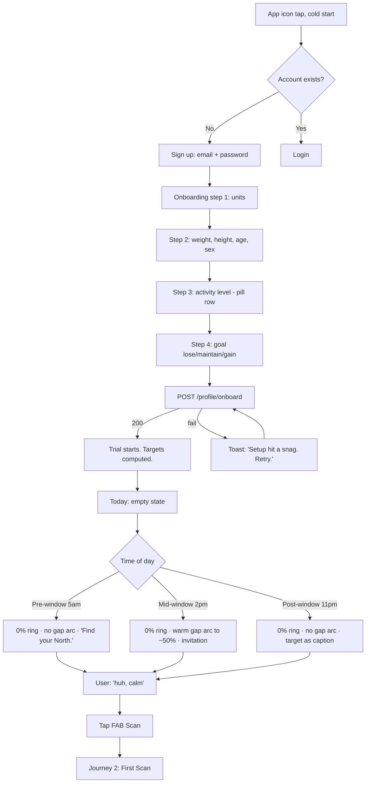
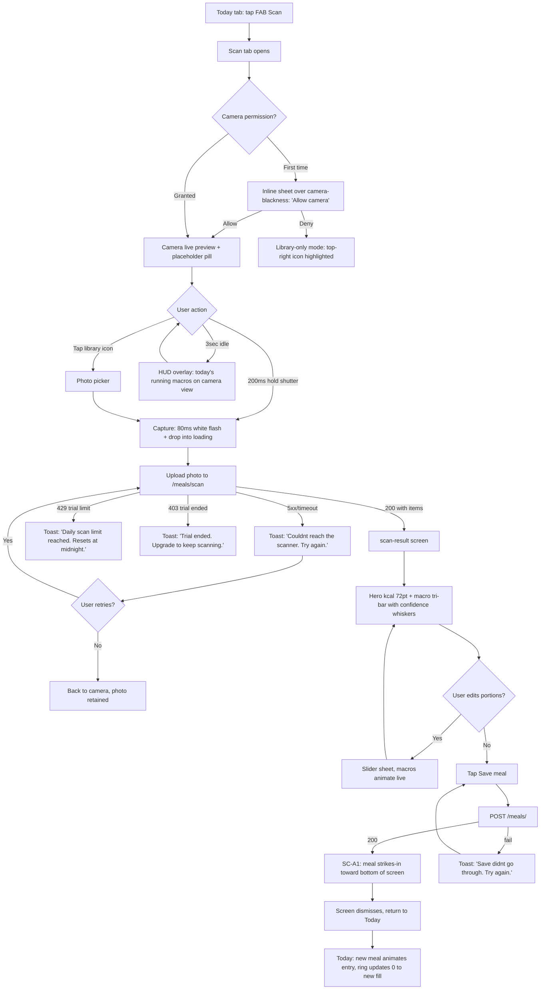
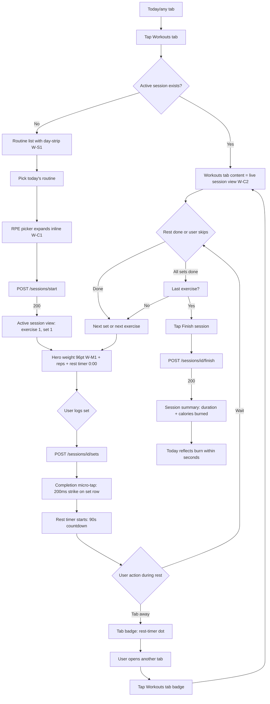
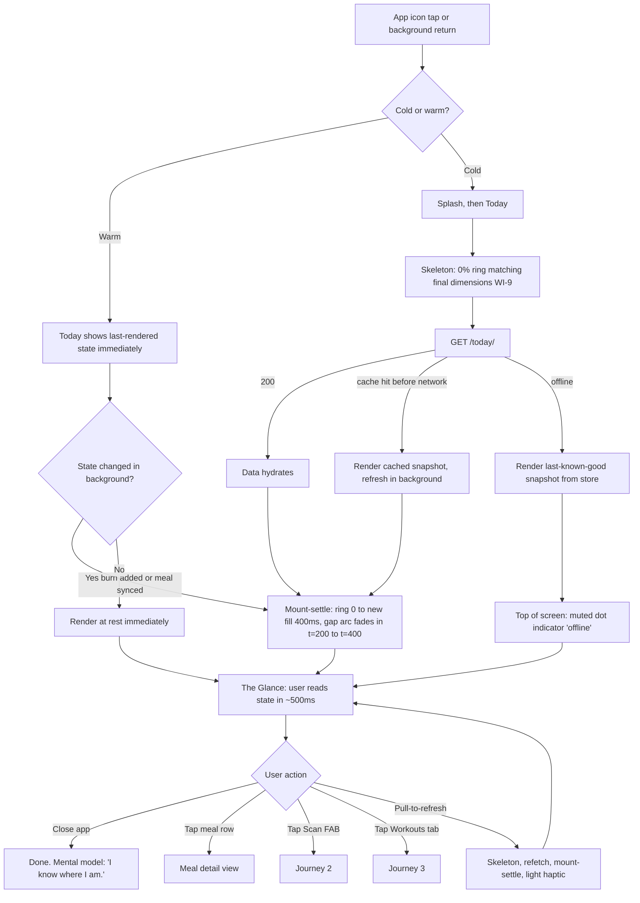
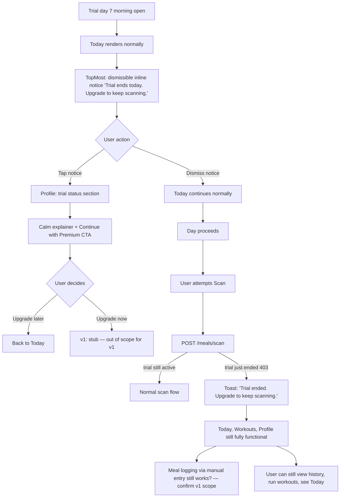
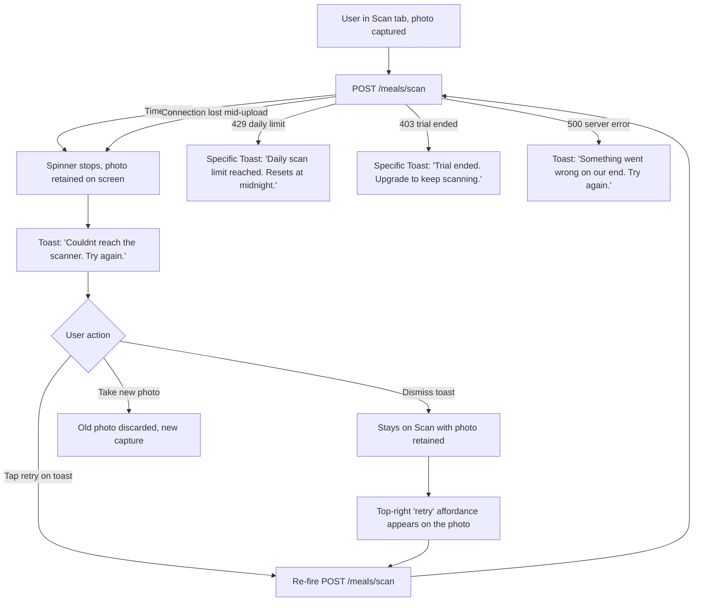

# UX Design Specification — YourStrat

**Author:** Brady J Bania
**Date:** 2026-05-24
**Module:** BMad Method · `bmad-create-ux-design`

---

<!-- UX design content will be appended sequentially through collaborative workflow steps -->

## Executive Summary

### Project Vision

YourStrat is a focused fitness coach built around three jobs done well: snap a meal photo to get its nutrients, build and run your own workout routines, and see the day at a glance. The metaphor is the **North Star** — every meal and workout aligns the user with their goal. The voice is calm, direct, navigational; the visual language is monochrome on near-black with a single cool-blue spark. Premium feel comes from discipline (tabular numbers, density, motion only on state change), not decoration.

Binding rails (from CLAUDE.md and YOURSTRAT_BUILD.md §2): premium feel at 60 FPS, one theme end-to-end, every UI wired to a real backend endpoint in the same PR. No streaks, leaderboards, social, push notifications, AI commentary, body avatars, confetti, multi-model orchestration, paywall UI, or graphs beyond a 7-day sparkline.

### Target Users

The primary user is a **casual but committed** person on a phone — not a macro-counting power user, not a beginner who needs hand-holding. They open the app in **brief transactional sessions** (log a meal, glance, close), often *in motion* (kitchen counter, gym, couch). They want to know in **under 5 seconds**: "am I on track today?" They trust their own judgment about food; they want fast, good-enough macro estimates (target ~85–90% honesty per [docs/AI_ACCURACY.md](../../docs/AI_ACCURACY.md)) — not lab precision. They are within a 7-day trial → future-premium funnel.

UX defaults (from [AGENTS.md](../../AGENTS.md)): prefer auto-defaults over required busywork; name things for users when they skip; design for casual, not power, users.

### Key Design Challenges

1. **The premium-vs-disciplined paradox.** Deliver Apple Health / Linear / Strong polish without the standard "premium" tricks (streaks, celebrations, ambient motion, AI commentary) — all of which are forbidden by the scope guard. The answer is the 5 DNA Laws (Hero / Numeric / Motion / Density / Sparkline) applied consistently across all 5 surfaces.

2. **One-app feel across 5 tabs.** Today, Workouts, Scan, Profile, and the nutrition view embedded in Today each need their own hero metric (LAW-1) but must read as one product. The Today tab's pacing-instrument precedent set the bar; Workouts and Scan need equivalent visual signatures.

3. **UI ↔ backend wiring without orphans.** Every button traces to a real endpoint; every endpoint has a UI consumer in the same PR. Five small backend gaps identified in the brainstorm (`target_pace_kcal_now`, `workout_completion_today`, `recovery_hours_since_last_session`, scan `confidence_range`, `vs_avg_kcal`) must ship as schema-paired changes.

4. **Motion that means something.** Only three approved animations (state-flip spring, completion micro-tap, digit-cycle tally). No decorative motion. Every screen must feel responsive without breathing, pulsing, or bouncing.

5. **Active-session continuity.** Tab away mid-set, tab back, no lost state. Touches Zustand persistence, tab-badge rendering, cold-start restoration, and a backend `/sessions/active` endpoint that may not exist yet.

### Design Opportunities

1. **Tabular-num typography as the brand.** Make the numbers themselves the visual signature — not gauges or rings *around* numbers. Showcase: 96pt readable-from-6-feet weight on the active-session screen (W-M1).

2. **Cross-screen motion continuity.** Scanned meal strikes in toward the bottom, screen dismisses, the same meal animates its entry on Today (SC-A1). Most fitness apps teleport between screens — this is a defensible "one-app" moment.

3. **Subtractive density as competitive advantage.** Remove section headers, page subtitles, loading spinners, modal stacks, duplicate cards. Less to build, harder to imitate, reads as confidence.

4. **The Pace Ring as the app's signature gesture.** Same component as today's `IntakeRing` with a more honest signal — "am I on track *right now*." Defines the product's relationship with the user: calm awareness, not nagging. Geometry already designed in the [2026-05-20 Today-tab UX spec](today-tab-ux-design-2026-05-20.md); this specification inherits and propagates the pattern.

5. **Scan-result confidence whiskers.** Visually encode Gemini's uncertainty without a single word of disclaimer copy — honest about AI accuracy without cluttering the screen.

## Core User Experience

### Defining Experience

YourStrat is built around three interleaved sessions on a single device:

- **Loop A — "Did I eat right?"** (12+ times/day, 5-second sessions). Open → glance at Today's ring → decide. The Pace Ring (T-S1) answers "am I on track *right now*" with geometry alone. This loop runs constantly and is the product's heartbeat.

- **Loop B — "I just ate something."** (3–5 times/day, 30-second sessions). Scan → hold-to-capture → confirm → save with strike-in animation back to Today (SC-A1). This is the product's reason to exist; photo-to-saved must complete in under 8s exclusive of model inference.

- **Loop C — "I'm at the gym."** (0–1 times/day, 30–60-min sessions). Pick or resume routine → 96pt weight readable from 6ft (W-M1) → log set → rest timer → next set. Active-session takeover (W-C2) means re-opening the Workouts tab resumes the session exactly where the user left off.

### Platform Strategy

**iOS + Android via Expo. Phone-only. Portrait-locked. Touch-first.**

- No tablet, no web for product surface (web preview is dev-only via Metro proxy).
- No keyboard input outside onboarding, edit forms, and exercise names.
- Hardware integration as opportunity, not requirement (volume-button set-advance during sessions is a deferred Tier-6 idea).
- Camera + photo library first-class; haptics tightly rationed (refresh success and error states only).
- Offline: Today must render last-known-good snapshot; Scan inherently requires network and surfaces an honest "couldn't reach the scanner" toast on failure.
- Background/foreground: active session survives backgrounding; timer derives elapsed from `startedAt`, not in-memory tick.
- Cold start: app opens to Today; if an active session exists in backend, the Workouts tab badge shows a dot and tapping it goes straight to the live session.

### Effortless Interactions

1. **The Glance.** Today tab pacing state legible in under 500ms; zero text parsing for "ahead or behind" — solved by Pace Ring geometry + tonal shift.
2. **Hold-to-capture.** 200ms hold (SC-S2) prevents accidental captures; tap-to-capture remains as fallback.
3. **Scan → Today continuity.** Saved meal strikes in toward bottom, screen dismisses, meal animates its entry on Today (SC-A1). The user watches it land.
4. **Resume the workout from anywhere.** Active session takes over the Workouts tab content (W-C2); tab-badge rest timer keeps state visible.
5. **Read your set without leaning in.** 96pt tabular weight (W-M1) — readable across a squat rack.
6. **Edit portions without leaving the result.** Slider sheet with macros animating live (SC-A2); no "save to preview" friction.
7. **Defaults that name things for the user.** Auto-name skipped routines; default macro split 30/40/30; default goal "maintain" (per [AGENTS.md](../../AGENTS.md) UX defaults).

### Critical Success Moments

| Moment | Success looks like | Failure looks like |
|---|---|---|
| **First scan, first day** | Photo → ~3s wait → believable macros → save → meal lands on Today | Absurd macros, or the save flow leaves the user wondering where the meal went |
| **First "am I on track?" glance** | At 2pm with one meal logged → warm gap arc curving toward pace position | Ring is full at 8am, or empty at 11pm with no signal change |
| **First active workout** | Start → log first set → rest timer → log next set without thinking | Lose set state on screen timeout; can't read the weight from the bench |
| **Tab away mid-set, return** | Workouts tab badge shows the rest-timer dot; tap → exactly where you left off | Active session "lost"; user has to dig through history |
| **Trial end-of-day, day 7** | Calm Profile badge | Hijacked screen, aggressive paywall copy |
| **Network blip during scan** | Friendly toast: *"Couldn't reach the scanner. Try again."* | `[object Object]`, infinite spinner, lost photo |

### Experience Principles

1. **Glance before read.** Hero questions answered by geometry, color, and weight first; words are second.
2. **Motion only on meaning.** Three approved animations (state-flip spring, completion micro-tap, digit-cycle tally). Steady state is dead-still.
3. **Numbers are the brand.** Tabular-nums weight-600 everywhere; digit-cycle on change. The typography itself is the visual signature.
4. **Subtract until it hurts, then stop.** Cut section headers, page subtitles, redundant cards, modal stacks. Density via weight and whitespace, not boxes.
5. **The day is one app.** Cross-screen state continuity is non-negotiable — Scan→Today motion, Workouts→Session resume, Today reflecting burn within seconds of workout finish.
6. **Defaults over decisions.** When the user skips, the app names it. When the AI is unsure, the UI shows the uncertainty (SC-C1) without making the user read about it.
7. **Calm and navigational, never coachy or apologetic.** *"Find your North." "1,420 left."* — not *"You're doing great! Keep it up!"*

## Desired Emotional Response

### Primary Emotional Goals

**Calm Competence.** The user closes the app feeling like they understand their day — not motivated, not warned, not praised. Understood. The product is a quiet instrument that tells the truth and gets out of the way. This is the deliberate opposite of mainstream fitness apps (MyFitnessPal anxiety, Noom guilt, Strava social-comparison adrenaline, gamified streak-protection panic). Using YourStrat should *lower* cognitive load, not add to it.

Secondary feelings, in priority order:

1. **Trust in the numbers** — honest about uncertainty, never falsely precise.
2. **Self-attributed agency** — the user did it, not the app.
3. **Quiet pride in the polish** — background pleasure of a well-made instrument.
4. **Restoration after gym fatigue** — Loop C screens don't demand back.
5. **Anticipation of opening it again** — like a clock you trust, not a streak you need to protect.

### Emotional Journey Mapping

| Stage | Feeling | UX guarantees |
|---|---|---|
| **First open (onboarding → Today)** | Curiosity → quiet relief | Onboarding under 90s; no tutorial overlays; *"Find your North"* sets the posture |
| **Loop A — The Glance** (12+/day) | Recognition → relief or mild course-correction | Pace Ring legible in <500ms; geometry-first answer; no spike |
| **Loop B — Logging a meal** (3–5/day) | Slight hover of doubt → relief at believable numbers → satisfaction at strike-in | Confidence whiskers carry honesty; SC-A1 cross-screen motion provides closure |
| **Loop C — Active workout** (0–1/day) | Focus on the lift; screen as instrument | 96pt weight; rest timer in peripheral vision; no decisions between sets |
| **End of workout** | Clean closure | Summary shows math, not celebration; Today reflects burn within seconds |
| **End of day** | Understood, not judged | No "you did good/bad" copy; tomorrow is a fresh ring; no carry-over guilt/pride |
| **When something fails** | Mild friction, never alarm | Toast (not alert) with calm declarative copy + retry; W-C2 lost-state recovery |
| **Trial ending** | Respected, not coerced | Calm Profile badge; dismissible Today notice; no paywall slammer |

### Micro-Emotions

| Critical state | Anti-state | Design lever |
|---|---|---|
| Confidence | Confusion | LAW-1 (one hero per surface), geometry-first answers in <500ms |
| Trust | Skepticism | Confidence whiskers (SC-C1), honest accuracy posture, no hidden inference |
| Accomplishment | Frustration | Math acknowledges the user, never copy; W-C2 prevents lost state |
| Satisfaction | Delight (gimmicky) | Consistency is the pleasure, not surprise moments |
| Focus | Distraction | Active session = one job (log next set); no competing chrome |
| Closure | Open loops | Every action has definite end-state; no "did that work?" limbo |

### Design Implications (Emotion → UX)

| Emotion to evoke | UX choice |
|---|---|
| Trust in the numbers | Tabular-nums weight 600; single `formatKcal()` helper (AP-11); confidence whiskers (SC-C1); honest accuracy copy |
| Calm during pace correction | Pace Ring uses warm/cool tone arcs at 25% opacity, not red-alarm; 5% threshold prevents jitter; gap arc disappears on pace (silence = success) |
| Restorative focus during gym | 96pt weight (W-M1); fixed-position rest timer; single-action set logging; tab badge eliminates navigation tax |
| Quiet pride in polish | 60 FPS Reanimated; zero layout jump (WI-9); cross-screen motion continuity (SC-A1); type weights snap to 700/600/400 only |
| Self-attributed agency | No "you did it" copy ever; targets as ratios, not scores; achievements rendered as math |
| Closure without celebration | Completion micro-tap (LAW-3 #2) is the *only* celebration animation; no confetti, no haptic burst, no toast on success |
| Recovery from error | Toasts with calm copy + retry; lost-state recovery (W-C2 restore); offline Today renders last-known-good |
| Welcome without overwhelm | Onboarding <90s; no tutorial overlays; *"Find your North"* is the only branded copy on empty states |

**Emotions to Avoid:** Anxiety, guilt, pressure, confusion, performance-theater anxiety, cognitive-load tax, frustration. Each maps to a specific scope-guard rail or anti-pattern in the brainstorm catalog (AP-3, AP-4, AP-6, AP-15, AP-16).

### Emotional Design Principles

1. **The instrument never raises its voice.** No screaming colors, no exclamation marks, no haptic explosions, no "you missed your goal" copy. State changes use the smallest motion that conveys them.
2. **The user is the protagonist; the app is the wristwatch.** Wins are attributed to the user via math, not via app copy.
3. **Honesty beats reassurance.** Show AI uncertainty, show over-target, say when the network failed. Sugarcoating produces more anxiety long-term than calm truth.
4. **Silence is a success state.** Absence of notifications, absence of banners, absence of the gap arc — these are intentional signals.
5. **Each day is its own page.** No accumulated guilt, no accumulated pride. Yesterday doesn't reach forward into today's UI.
6. **The polish is the praise.** The user's reward for using the product is that the product is well-made. No additional gratitude theater.

## UX Pattern Analysis & Inspiration

### Inspiring Products Analysis

Eight reference products defined the 5 DNA Laws and contribute distinct patterns:

**Apple Health** — hero numerical cards with quiet "today vs. average" pill; rings as calibrated trust-symbol; sparklines as whispers; declarative empty states.
*Lesson:* numbers are the trust signal; small context pills beat full charts.

**Linear** — state-change springs (issue-status flip), keyboard-first density, zero gratuitous animation, screens that load with final shape.
*Lesson:* animation earns its place only when state changes; stillness is polish.

**Strong** — pure tabular workout log; per-set rows readable at arm's length; minimal-chrome active session.
*Lesson:* in-gym = spreadsheet; every pixel of decoration is friction.

**Whoop** — strain/recovery/sleep as dominant single numbers; secondary trio with tiny labels + big tabular numbers + sparklines below each.
*Lesson:* surfaces can support a hero + 2–3 supporting numbers without becoming busy if hierarchy is brutally enforced.

**Things 3** — strike-through-and-slide on completion; single tap → 200ms commit → row gone. Completing feels good without explicit celebration.
*Lesson:* the completion micro-tap is the *only* celebration the app needs.

**Strava (sparkline only)** — activity charts that show pace without forcing analysis. Explicitly *not* stealing the social feed/kudos/leaderboards.
*Lesson:* sparkline as trend whisper is universally transferable.

**Stripe Dashboard** — drop all card backgrounds; use type weight and whitespace alone for hierarchy; receipt-grade density.
*Lesson:* the most premium-feeling lists look like printed receipts.

**Headspace / Calm** — `cubic-bezier(.32, .72, 0, 1)` easing curve; weighted, organic, never bouncy "settle" feel.
*Lesson:* a single universal easing curve is signature; consistency is what makes the app feel like one product.

### Transferable UX Patterns

**Navigation:**
- Active session takes over its tab (Linear / Strava → W-C2)
- Tab badge for live state (Linear / Whoop → Workouts tab rest-timer dot)
- Hero × Surface mapping (Whoop → LAW-1 across all 5 tabs)
- Cross-screen state continuity (Linear → SC-A1 Scan→Today motion)
- Modal elimination via inline expansion (Things 3 / Linear → W-C1, SC-A2)

**Interaction:**
- State-flip spring 300ms (Linear → LAW-3 #1)
- Completion micro-tap 200ms strike/lock (Things 3 → LAW-3 #2)
- Digit-cycle tally (Stripe analytics → LAW-3 #3)
- Hold-to-capture (Snapchat / Instagram → SC-S2)
- Sparkline scrubber (Robinhood → N-P1)
- "Today vs. average" pill (Apple Health → N-A1)
- Compare-and-correct via gap arc (Whoop / Apple Activity → T-S1 Pace Ring)

**Visual:**
- Tabular-nums weight 600 everywhere (Stripe / Linear → LAW-2)
- No card backgrounds for list-as-data (Stripe → N-A2)
- Single accent color sparingly (Linear → `colors.spark` reserved for "burned"/active)
- Sparkline-as-whisper (Strava / Apple Health → LAW-5)
- Hero number 56–72pt (Apple Health / Whoop → LAW-1)
- 96pt readable-from-distance (Strong → W-M1 active-session weight)
- Universal easing `cubic-bezier(.32, .72, 0, 1)` (Headspace)

### Anti-Patterns to Avoid

The 18-item catalog from the brainstorm is binding. Grouped by emotional impact:

**Violate Calm Competence:** AP-3 confetti-adjacent, AP-4 decorative motion, AP-6 pity copy, AP-9 toast spam, AP-15 AI whisper creep.

**Violate Trust in the Numbers:** AP-1 random hex drift, AP-11 numeric cosmetic drift, AP-13 branded loading states.

**Violate Restorative Focus (gym):** AP-8 tap-target discounting, AP-16 modal stack hell, AP-12 icon inflation.

**Violate Premium / 60 FPS:** AP-2 magic padding, AP-5 loader strobing, AP-7 section-header inflation, AP-14 boundary-less scroll, AP-17 performance theater, AP-18 off-theme native components, AP-10 form-as-wall.

Each anti-pattern has a specific guardrail (token enforcement, helper functions, pre-commit greps, PR-review checks) in the [brainstorm's full table](../brainstorming/brainstorming-session-2026-05-24-1301.md#phase-3--anti-pattern-catalog-18-anti-patterns).

### Design Inspiration Strategy

**Adopt verbatim:**
- Headspace easing `cubic-bezier(.32, .72, 0, 1)` — universal across all motion.
- Things 3 strike-in (200ms strike/lock) — the completion micro-tap.
- Linear state-flip spring (300ms) — on real state change only.
- Stripe receipt density — no card backgrounds for list-as-data.
- Apple Health vs-average pill — N-A1 compact context.

**Adapt:**
- Whoop hero-and-trio pattern → T-A2 with YourStrat mono palette + cool-blue spark.
- Strong spreadsheet active session → W-A1 with our type/spacing/animation system.
- Linear issue-move → T-A1 + SC-A1 cross-screen meal-add motion.
- Apple Health sparklines → LAW-5 always secondary, never hero.

**Explicitly Avoid:**
- MyFitnessPal reminder culture (push notifications) — forbidden by §2.
- Noom coachy onboarding — forbidden by §2.
- Strava social comparison — forbidden by §2.
- Calorie-counter "weekly insight" AI commentary — forbidden by §2 + AP-15.
- Strong's IAP-aggressive paywall slammers — v1 has no paywall; future premium must avoid this pattern.

## Design System Foundation

### Design System Choice

**Custom design system built on NativeWind 4 + React Native primitives**, with design tokens in [mobile/theme/](../../mobile/theme/) and primitive components in [mobile/components/ui/](../../mobile/components/ui/). Not Material, not a third-party UI kit, not a themeable shell library.

The system is already in production; this UX spec extends it rather than choosing it. The decision is documented here for record and onboarding.

### Rationale for Selection

1. **Brand voice forbids defaults.** Material elevation, iOS HIG native pickers (AP-18), Ant Design chrome — all carry visual baggage incompatible with calm-monochrome-on-near-black. Premium feel comes from discipline within constraint; a third-party kit imports the wrong constraint.
2. **Forbidden features inform the components.** Most UI kits include patterns (badges, social cards, notification bells, leaderboards) that are §2 violations. Building from primitives means those components don't exist in the codebase — they can't accidentally ship.
3. **60 FPS demand requires Reanimated discipline.** Many kits ship JS-thread animations or layout-animated transitions incompatible with the rail. Custom = full control over the worklet boundary.
4. **"Every UI wired to backend" rule keeps components shallow.** YourStrat components are render-only; data flow is Zustand + API wrapper. A heavy DS with built-in state management would create competing abstractions.

### Implementation Approach

**Tokens** ([mobile/theme/](../../mobile/theme/)) — the source of truth:
- [colors.ts](../../mobile/theme/colors.ts) — surfaces, brand, text, status, macros, pacing arc colors.
- [spacing.ts](../../mobile/theme/spacing.ts) — `xs/sm/md/lg/xl/xxl/xxxl` = `4/8/12/16/24/32/48`; `radius` tokens `sm/md/lg/xl/pill`.

**Primitive components** ([mobile/components/ui/](../../mobile/components/ui/)) — `Screen`, `Button`, `Input`, `OptionCard`, `Card`, `Toast`, `ProgressBar`, `Skeleton`, `LinkButton`, `BackHeader`.

**Domain components** ([mobile/components/](../../mobile/components/)) — `IntakeRing`, `MealCard`, `RestTimer`, `TodayHeader`, `CalorieSparkline`, `TodayTrioCards`.

**Icons** ([mobile/components/icons/](../../mobile/components/icons/)) — 24×24 viewBox, 2px stroke (except `Star`), color inherited. Locked set per YOURSTRAT_BUILD §9; adding an icon requires asking first.

**Typography:** System font stack. Three weights only: 700 (headings), 600 (numerics with `fontVariant: ['tabular-nums']`), 400 (body). No weight 500, no italic, no letter-spaced uppercase eyebrows (AP-7).

**Motion:** Reanimated shared values + worklets. Universal easing `cubic-bezier(.32, .72, 0, 1)` (Headspace). Three approved animations only; anything else requires PR-review justification (Tier-2 guardrail).

**Operating rules:**
- Token-first, never inline. Raw hex (AP-1) and magic padding (AP-2) blocked by pre-commit grep.
- Primitives composable, never bypassed. Inputs always through `ui/`, never raw `<TextInput>`/`<Pressable>` for interactive controls (AP-18 prevention).
- Domain components own their *data contract*, not their look. `IntakeRing` accepts props; doesn't fetch, doesn't compute pace position.
- Variants are added, never forked. New button variant → added to `Button.tsx`, never a separate `DangerButton.tsx` file.

### Customization Strategy

**New tokens this UX spec adds:**
- `paceWarmGap: rgba(251, 191, 36, 0.25)` — amber at 25% for "behind pace" gap arc.
- `paceCoolGap: rgba(201, 204, 214, 0.25)` — `starDim` at 25% for "ahead of pace" gap arc.
- (Deferred) `confidenceWhisker` for SC-C1 — TBD in step 11.

**Components this UX spec proposes adding** (each ask-before-add per CLAUDE.md §8):
- `PillRow` (P-M2) — horizontal pill-row for Activity/Goal onboarding selection.
- `WeightHero` or similar — 96pt tabular weight display for active sessions (W-M1).
- `MacroBar` — 8pt P/C/F tri-color horizontal bar for meal rows (T-C2) and day rows (N-C2).

**No styling system migration.** NativeWind 4 stays.

**No icon library import.** Custom SVG icon set stays; new icons hand-authored matching existing stroke-width and viewBox.

**Deferred to step 11 (Component Strategy):**
- Bottom-sheet / modal pattern definition.
- `PillRow` vs `SegmentedControl` abstraction choice.
- Whether to extract a reusable `Sparkline` primitive.

## Defining Experience

### The Defining Interaction

**"I open the app and *see* how my day is going — without reading anything."**

The Glance at the Pace Ring is YourStrat's defining experience. The phone comes out of the pocket, the app opens to Today, and within ~500ms the user has read their state from geometry and color alone — ring fill (consumed), gap arc tone and presence (ahead/behind/on pace), hero number (magnitude). No copy parsing, no chart interpretation.

This is the moment that makes YourStrat different from every other fitness app the user has tried. It's the interaction that runs 12+ times a day, and the sentence they use to describe the product to a friend.

### User Mental Model

Users arrive with experience from apps that failed them:

| Existing solution | Mental model | Why it fails |
|---|---|---|
| MyFitnessPal | "I have to log to know" → tedium → guilt | Check-in costs more than the answer is worth |
| Apple Health | "Rings I have to close" | Activity, not nutrition; wrong question |
| Fitbit Premium | "Charts I'll review on Sunday" | Retrospective; useless for in-moment decisions |
| Mental tally | "Maybe ~1200 calories?" | Inaccurate; degrades throughout day |
| "Eat intuitively" | "I trust my body" | No feedback loop = no calibration |

YourStrat replaces these with: *"My phone knows where my day is. I look at it like I look at a clock. Warmth = invitation. Coolness = ease off. Silence = on pace."* The crucial shift is that **the user stops auditing themselves** and starts using the app as an extension of their awareness.

The mental model installs itself through use, not through tutorials. The first-day "empty state at 2pm with a warm gap arc curving toward 50%" is the design's silent teacher.

### Success Criteria

The Glance succeeds if and only if:

1. **Time-to-Insight ≤ 500ms** from tap to cognitive registration of pace state.
2. **Zero text required to read state** — arm's length, glance, answer.
3. **No false signal** — no "behind pace" at 7am; no strobing across the 5% threshold.
4. **No emotional spike** — warm arc is *inviting*, not accusing; red is factual, not alarming.
5. **Returning later feels the same** — Glance #3 of the day looks like Glance #1; no progress narrative.
6. **The user trusts the number** — after 3–4 days, geometry and felt-state converge.
7. **The user starts *not* glancing** — after a week, they know their pace; the Glance becomes confirmation, not discovery.

### Novel UX Patterns

- **Component is familiar.** Ring-based progress indicators are universal (Apple Activity, Whoop, Strava). No user education needed for the *shape*.
- **The pace-tick gap arc is novel.** Two-arc system where the gap *between* current and expected state is the visual statement. Closest analogue: Apple Activity's static target line — but no app uses a time-of-day pace position as a running signal.
- **The combination is the moat.** Familiar component + novel signal = zero-tutorial adoption. Meaning installs through context.

**User education:** No onboarding tutorial about the ring. One-line caption on the first-ever Today render: *"Tap to scan your first meal."* That's it. The "compass / North Star" brand language reinforces the instrument metaphor.

### Experience Mechanics

**1. Initiation.** User-initiated. No push notifications, no prompts. The app never invites the Glance; the user's own loop does.

**2. Cold-open or warm-resume.**
- *Warm:* Today shows last-rendered state immediately; mount-settle fires only if background-state changed (e.g., workout burn). Fresh state in 400ms.
- *Cold:* Splash → Today → skeleton at frame 0 with placeholder ring at 0% matching final dimensions (WI-9) → data hydrates → mount-settle animation: ring strokes 0 → fill over 400ms; gap arc fades in t=200ms to t=400ms at 25% opacity. Per [2026-05-20 Today-tab UX precedent §6](today-tab-ux-design-2026-05-20.md#6-animation).

**3. The Glance.** Eyes land on ring within ~150ms. By ~500ms:
- Ring fill registers: "how much I've consumed."
- Gap arc presence/tone registers: "ahead, behind, on pace."
- Hero number registers: "magnitude of remaining."
- Equation row registers: "the math, if you want it."

**4. Feedback.** The ring *is* the feedback. If returning from a meal-log, ring fill animates prev → new via state-flip spring (300ms, Headspace easing); hero number ticks instantly (no count-up gimmick). User watches the meal land (SC-A1 + T-A1 cross-screen motion continuity).

**5. Completion.** No explicit done-state. Glance ends when user navigates away or puts the phone down. Successful outcome = *understanding*.

**6. Pull-to-refresh.** Skeleton → fetch → mount-settle. One light haptic on success (optional per Today-tab UX precedent §9). Only system feedback on Today.

**7. Edge cases (per Today-tab UX precedent §8):**
- No profile → 0% ring, *"Find your North."*
- Pre-window (5am), no meals → 0% ring, no gap arc.
- Mid-window (2pm), no meals → 0% ring, **warm gap arc to ~50% pace** — the brand's quiet pull, design as silent teacher.
- Post-window (11pm), no meals → 0% ring, no gap arc.

**8. Over target.** `consumed > target` → ring fill `colors.error`, hero number `colors.error`, gap arc not drawn. Factual, not alarming.

**9. Backend wiring (required):**
- `GET /today/` includes new `target_pace_kcal_now` from [backend/app/routers/today.py](../../backend/app/routers/today.py).
- Schema in [backend/app/models/schemas.py](../../backend/app/models/schemas.py) + matching TS type in [mobile/lib/api.ts](../../mobile/lib/api.ts) updated in the same PR (CLAUDE.md §5 rule 4).
- Pace position computed server-side for widget forward-compat (Today-tab UX precedent §12.1); client may compute via `mobile/lib/pace.ts` if stale.

## Visual Design Foundation

### Color System

**Brand guidelines exist and are binding.** Tokens live in [mobile/theme/colors.ts](../../mobile/theme/colors.ts) and YOURSTRAT_BUILD.md §3.2. This UX spec extends, never replaces.

**The full palette (source of truth):**

| Token | Hex | Role | Usage rule |
|---|---|---|---|
| `bg` | `#08080B` | Root app background | Every Screen's outer background. Never tinted. |
| `surface` | `#121217` | Card/list-item surface | Default Card background; never as a hero element |
| `surfaceElevated` | `#1B1B22` | Raised surface (modals, focused inputs) | Use sparingly — elevation should be earned |
| `border` | `#26262F` | Hairlines and ring track | 1px borders only; never 2px+ |
| `star` | `#FFFFFF` | Brand accent + primary ring fill | Highest-visual-weight element on a screen |
| `starDim` | `#C9CCD6` | Secondary brand tint + "ahead of pace" ring fill | When `star` would be too loud |
| `spark` | `#7DD3FC` | Cool accent — *the* single brand color | **Reserved for "burned calories" cell + active workout states.** Do not use elsewhere |
| `textPrimary` | `#FAFAFA` | Hero numbers + headings | All H1/H2/hero numerics |
| `textSecondary` | `#A1A1AA` | Body text + labels | Equation row labels, meal-card metadata |
| `textMuted` | `#71717A` | Tertiary metadata + sparkline ink | Date stamps, helper text, sparkline lines |
| `disabled` | `#3F3F46` | Disabled controls + skeleton fills | Button disabled state, Skeleton blocks |
| `success` | `#34D399` | Success confirmation (rare) | Reserve for genuine success states; *not* "on pace" (silence is the on-pace signal) |
| `warning` | `#FBBF24` | Warning/at-target indicators | Same hue as `carbs` — used as 100%-α only for status, 25%-α for the warm pace arc |
| `error` | `#F87171` | Over-target + hard errors | Ring fill when `consumed > target`; hero number when remaining < 0 |
| `urgent` | `#FB7185` | Destructive actions (delete account) | The only place a red-pink appears |
| `protein` | `#60A5FA` | Protein macro bar | Blue — never used outside macro contexts |
| `carbs` | `#FBBF24` | Carbs macro bar | Amber (= `warning` hue) — never used outside macro contexts |
| `fat` | `#F472B6` | Fat macro bar | Pink — never used outside macro contexts |

**New tokens this UX spec adds to `colors.ts`:**

| Token | Value | Role |
|---|---|---|
| `paceWarmGap` | `rgba(251, 191, 36, 0.25)` | "Behind pace" gap arc — amber at 25% α (NOT `warning` at 100%, which would alarm) |
| `paceCoolGap` | `rgba(201, 204, 214, 0.25)` | "Ahead of pace" gap arc — `starDim` at 25% α (stays in the ring's value family) |

**Color discipline (binding):**

- **Never inline a hex code.** Every color goes through `colors.X` reference. AP-1 enforced via pre-commit grep (Tier-2 guardrail).
- **`spark` is the *only* brand accent.** It appears only in the "burned" equation cell on Today, the active set highlight in workout sessions, and the in-progress state of long actions. Using it elsewhere dilutes the brand.
- **The macro triplet (`protein/carbs/fat`) is sealed.** Used only for macro bars. Never as decorative colors.
- **Status colors are rare by default.** `success` never fires on "on pace" (silence is success); `warning` never fires on "behind pace" (the warm gap arc carries that signal); `error` only on actual over-target or system errors.
- **Adding a new token requires asking first** (CLAUDE.md §4). Brady's call, every time.

**Contrast & accessibility:**

- All text-on-bg pairs are above WCAG AA (4.5:1) and most are above AAA (7:1) — verified by the existing palette being near-white on near-black.
- `textPrimary` on `bg` ≈ 18.5:1 (AAA passes).
- `textSecondary` on `bg` ≈ 9.5:1 (AAA passes).
- `textMuted` on `bg` ≈ 5.3:1 (AA passes, AAA fails — acceptable for metadata only, never for body text).
- The pacing arc colors at 25% α are *decorative geometry*, never carry information by color alone (presence/absence is the binary signal; tone is a secondary cue). Color-blind users can still read the geometry.

### Typography System

**System font stack.** No custom font loading — keeps cold-start fast, avoids licensing complexity, inherits each OS's hinting and rendering. Stack: `-apple-system, BlinkMacSystemFont, "Segoe UI", Roboto, ...` (React Native's `System` font).

**Three weights, no more.**

| Weight | Use | Examples |
|---|---|---|
| **700** | Headings, hero text | Onboarding heading; Today's *"Find your North."*; `BackHeader` title |
| **600** | Numerics — *always with `fontVariant: ['tabular-nums']`* | Every kcal value, weight value, rep count, timer value, macro gram count |
| **400** | Body text, labels, metadata | Section copy, meal-card name, equation row labels |

**Weight rules:**

- **No weight 500.** Skips the middle weight intentionally; the gap between 400 and 600 *is* the hierarchy.
- **No italic.** Anywhere. Italic is a slant; the brand voice is upright.
- **No letter-spaced uppercase eyebrow labels** (AP-7). Section hierarchy uses weight and whitespace, never tracking.

**Type scale (no formal scale — instead, *contextual sizes*):**

The 5 DNA Laws (LAW-1) demand "one dominant number per surface, 56–72pt." So the scale isn't a fixed h1/h2/h3 ladder — it's a *role* ladder, with sizes picked per surface based on what's hero:

| Role | Size | Weight | Surfaces |
|---|---|---|---|
| **Hero numeric** | 56–72pt | 600 tabular | Today kcal-left, Nutrition total-kcal, Scan-result kcal, Profile lifetime-kcal |
| **Mega hero (gym-readable)** | 96pt | 600 tabular | Active workout-set weight (W-M1) |
| **Hero label** | 14pt | 400 | "cal left", "cal over", "Tomorrow" |
| **Heading** | 28–32pt | 700 | Onboarding question text, BackHeader title |
| **Subhead** | 17–20pt | 600 | Inline section anchors (used sparingly — most sections need no header per T-E1) |
| **Body** | 15pt | 400 | Card content, meal names, descriptions |
| **Body numeric** | 15pt | 600 tabular | Equation row values, meal-card kcal |
| **Metadata** | 13pt | 400 | Time stamps, helper text, vs-avg pill |
| **Micro** | 11pt | 400 | Rare — image attributions, legal footnotes |

**Line-height:** 1.3× for body, 1.0× for hero numerics (numerics don't need extra leading; they read as glyphs).

**Letter-spacing:** Default for all text. No tracked uppercase. Hero number gets `letterSpacing: -1` per Today-tab UX precedent §11.

**Number formatting (binding for trust):**

- Single `formatKcal()` / `formatWeight()` / `formatMacroGrams()` helpers in [mobile/lib/](../../mobile/lib/) (Tier-2 guardrail per AP-11).
- Calories nearest 5; weight nearest 0.5 (metric) or whole pound (imperial); macros nearest gram; durations as `Hh Mm` or `M:SS`.
- Thousands separator: locale-aware via `Intl.NumberFormat`, fallback to comma.

### Spacing & Layout Foundation

**Spacing tokens** ([mobile/theme/spacing.ts](../../mobile/theme/spacing.ts)):

| Token | Pixels | Role |
|---|---|---|
| `xs` | 4 | Tight inline gaps (icon-to-text in a row) |
| `sm` | 8 | Inline padding inside small chips/pills |
| `md` | 12 | Compact row gaps; input internal padding |
| `lg` | 16 | Card internal padding; primary list row gap |
| `xl` | 24 | **Screen padding** (binding — every Screen uses this) |
| `xxl` | 32 | Section gaps |
| `xxxl` | 48 | Hero-to-content separation |

**Radius tokens** ([mobile/theme/spacing.ts](../../mobile/theme/spacing.ts)):

| Token | Pixels | Role |
|---|---|---|
| `sm` | 6 | Tags, micro-badges |
| `md` | 8 | Inputs (per current `Input` component) |
| `lg` | 12 | Compact cards, pills (alt to `pill`) |
| `xl` | 16 | Standard `Card` (binding) |
| `pill` | 999 | All `Button` variants (binding) |

**Layout principles:**

1. **Vertical rhythm uses spacing tokens only.** No magic `padding: 17` (AP-2 enforcement). Vertical sequence per screen typically: `xxl` between sections → `lg` between rows within a section → `xs` between baseline-aligned items.
2. **Single-column phone layout.** No multi-column grids (phone, portrait-locked). The exceptions are intentionally narrow: 7-day sparkline cells, day-strip chips (W-S1), macro bars.
3. **Max content width 480.** Wraps the Screen so tablets and rotated tablets (if ever) don't stretch line lengths to discomfort. Per current `Screen` primitive.
4. **24px screen padding everywhere.** Non-negotiable. The brand reads "premium" partly because every screen has the same gutter — a unified left edge across all 5 tabs.
5. **No nested cards.** Card inside Card is AP-4 (decorative density). If a card needs sub-grouping, use type weight or a single `border` divider, not a nested `Card`.
6. **No row dividers if fewer than 4 rows.** Whitespace alone carries the separation. Dividers are visual chrome; only used when scanning requires them.
7. **Hit targets ≥ 44×44pt.** Apple's standard, extended via `hitSlop` when a visual element is smaller (AP-8 prevention). Sweaty/wet hands need this.

**Grid:** No formal grid system. Single-column layout + token-based spacing + max-width wrapper = enough structure for a phone app. CSS-grid-style 12-column layouts are over-engineering for a 480px-wide canvas.

### Accessibility Considerations

**Color contrast** (already covered in Color System above): all body text exceeds WCAG AA; hero text exceeds AAA. Macro colors (`protein/carbs/fat`) used only on bars where shape/length carries primary information — color is supplementary, not the sole signal.

**Color-blind safety:**

- Pace state never relies on color *alone*. The gap arc's *presence* (not its color) is the primary signal: arc visible = off-pace; arc absent = on-pace. Color (warm/cool) is a secondary cue.
- Over-target uses both color (`error` red) AND positional cue (number sits past the ring's full circumference visually) AND copy ("cal over" vs "cal left").

**Reduced motion:**

- Respect `AccessibilityInfo.isReduceMotionEnabled()` in Reanimated worklets.
- When reduce-motion is on: skip mount-settle animations (render at final state directly); skip digit-cycle on number updates (snap); keep completion micro-tap as a 50ms opacity fade only.
- Steady-state behavior is unchanged — the app is already largely motionless, so reduce-motion is a small further reduction.

**Dynamic type / text scaling:**

- Use React Native's `allowFontScaling` default (true) on all body text — respects OS text-size preference.
- Hero numerics have `allowFontScaling={false}` only where layout depends on fit (the 96pt active-set weight, the 72pt hero kcal). Otherwise, scale.
- Test at 1.3× and 1.5× system sizing during step-13 responsive review.

**Screen reader:**

- All interactive elements get `accessibilityLabel` and `accessibilityRole`.
- Hero ring announces: *"1,240 calories remaining of 2,400. Behind pace by 280 calories."* — full state in one sentence, since geometric perception is unavailable to screen-reader users.
- Equation row marked as a group with `accessibilityLabel` summarizing: *"1,240 consumed, 280 burned, 1,240 remaining."*
- Active workout-set weight announces value + reps; rest timer countdown does *not* announce every second (would be torture) — only on transition (set complete, rest done).

**Touch targets:**

- 44×44pt minimum (AP-8); `hitSlop` extends touch areas for visual elements smaller than that.
- One-handed reach considered: primary actions (FAB, Start button) within thumb's natural arc on a 6.5"+ phone.

**Voice control / Switch control:**

- Inherits from screen-reader labeling — no additional surface needed for v1.
- Test on iOS Voice Control and Android Switch Access during step-13.

## Design Direction Decision

### Design Directions Explored

The conventional version of this step generates 6–8 visual variations and asks the user to pick one. **For YourStrat, the direction was already chosen and locked before this UX spec began** — by the 5 DNA Laws (brainstorm 2026-05-24), the Today-tab UX precedent (2026-05-20), and the CLAUDE.md operating contract. Exploring alternatives now would just relitigate decisions Brady has already made with conviction.

Three directions were *considered and explicitly rejected* during the brainstorm. They're documented here as **anti-directions** to make the chosen direction's discipline visible by contrast:

**Anti-direction A: "Encouraging Coach."** Vibrant gradient surfaces, motivational quotes on the Today empty state, streak counters, daily celebration animations on hitting target, push notifications nudging at meal times. *Rejected by §2 Scope Guard.* Every element on this list is forbidden; the direction is the literal opposite of YourStrat's brand.

**Anti-direction B: "Data Power-User."** Information-dense dashboards with multiple charts per screen, customizable widgets, weekly insight reports, multi-tab segmented controls on every screen, comprehensive macro/micro breakdowns. *Rejected by LAW-1 (one hero per surface) and AGENTS.md (target casual users, not power users).* Apps like Cronometer occupy this niche; YourStrat deliberately does not.

**Anti-direction C: "Playful & Friendly."** Rounded everything, soft pastels, character mascots, illustrated empty states, friendly copy with exclamation marks, "Great job!" toasts on every action. *Rejected by §2 + the calm/navigational voice rule.* This is the Duolingo aesthetic; YourStrat is anti-this.

### Chosen Direction

**"The Instrument."**

YourStrat is a quiet, dark, monochrome instrument — a wristwatch for nutrition and training. The visual language is calibrated to the single goal of letting the user *read state in under 500ms with zero cognitive overhead*.

**The five visual pillars of The Instrument:**

1. **Near-black background, monochrome foreground.** `#08080B` deep, slightly cool. White and `starDim` carry foreground weight. The single accent color `spark` (`#7DD3FC`) appears only on "burned" calorie cells and active workout states — rationed to about 5% of the screen at any time.
2. **Tabular numbers as the typeface signature.** Every numeric value is tabular-nums, weight 600. The numbers themselves are the brand mark, more than the compass-star logo. A user opening the app for the first time should immediately notice the numbers feel "different" — settled, mechanical, trustworthy.
3. **Hero geometry, ambient silence.** One dominant element per surface (a ring, a number, a row of pills). Everything else is supporting chrome at 60% visual weight. When nothing meaningful is happening, the screen is dead-still.
4. **Density via weight and whitespace.** No nested cards, no boxes-in-boxes, no decorative dividers. Hierarchy comes from the 700/600/400 weight ladder and the 16/24/32 spacing ladder. The result reads like a printed receipt, not a UI kit demo.
5. **Motion as semantic.** Three approved animations (state-flip spring, completion micro-tap, digit-cycle tally), one shared easing curve (`cubic-bezier(.32, .72, 0, 1)`). Motion fires only when state changes, never as decoration. The Headspace easing makes every transition feel *weighted*, never *bouncy*.

### Direction Applied — Surface Sketches

Sketches use ASCII to show layout intent. Real components are React Native + NativeWind 4 per the chosen design system. Each surface honors LAW-1 (one hero) and LAW-4 (subtractive density).

**TODAY** — Pace Ring as the day's instrument (T-S1 Tier-1 pick, geometry per [2026-05-20 Today-tab UX precedent](today-tab-ux-design-2026-05-20.md)):

```
┌─────────────────────────────────┐
│ Good evening.                   │  ← 700, textPrimary
│                                 │
│         ╭─────────────╮         │
│       ╱ ████████░░░░░ ╲         │  ← Ring: fill (star) + warm gap arc
│      │  ████████░░░░░  │        │
│      │                 │        │
│      │     1,240       │        │  ← 72pt 600 tabular textPrimary
│      │     cal left    │        │  ← 14pt 400 textSecondary
│      │                 │        │
│       ╲               ╱         │
│         ╰─────────────╯         │
│                                 │
│ 1,240 in · 280 burned · 1,240   │  ← Equation row, "burned" in spark
│                                 │
│ ─────────────────────────       │
│                                 │
│ Apple, chicken bowl       820   │  ← Meal rows, no card chrome
│ 11:42 AM                  cal   │
│ ─────────────────────────       │
│ Coffee, no sugar           5    │
│ 7:18 AM                   cal   │
│                                 │
│         ╭──────────╮            │
│         │   Scan   │ ← FAB      │
│         ╰──────────╯            │
└─────────────────────────────────┘
```

**WORKOUTS — Empty/Resting** — Day-strip + routine rows (W-S1, W-S2):

```
┌─────────────────────────────────┐
│ M  T  [W]  T  F  S  S           │  ← Day chip strip (today highlighted)
│                                 │
│ Push Day                  45m   │  ← Single-line row, swipe to start
│ 6 exercises                     │
│ ─────────────────────────       │
│ Pull Day                  50m   │
│ 5 exercises                     │
│ ─────────────────────────       │
│                                 │
│ Anytime                         │  ← Folded section (W-E2) — dimmed
│ Core finisher · 12m             │
│                                 │
└─────────────────────────────────┘
```

**WORKOUTS — Active Session (W-C2 Tier-1 takeover, W-M1 96pt weight)**:

```
┌─────────────────────────────────┐
│ Bench Press · Set 3/5           │  ← Exercise label, 600
│                                 │
│                                 │
│           185                   │  ← 96pt 600 tabular textPrimary
│            lb                   │  ← 20pt 400 textSecondary
│                                 │
│           ×  8                  │  ← Reps, 32pt 600 tabular
│                                 │
│ ─────────────────────────       │
│                                 │
│   ●●●●●●●○○○                    │  ← Rest timer ring (90s, ticking)
│       0:32                      │  ← Countdown, 24pt 600 tabular
│                                 │
│  ╭──────────────────────╮       │
│  │     Done with set    │       │  ← Primary, pill, 56px
│  ╰──────────────────────╯       │
└─────────────────────────────────┘
```

**SCAN — Camera view (SC-S2 hold-to-capture, SC-C2 recent strip)**:

```
┌─────────────────────────────────┐
│  ╭───────────────────────╮  📷  │  ← Camera preview, library icon top-right
│  │                       │      │
│  │   [live camera view]  │      │
│  │                       │      │
│  │   —— kcal · — P · — C │      │  ← Pre-shutter placeholder pill (SC-S1)
│  │                       │      │
│  ╰───────────────────────╯      │
│                                 │
│         ╭─────────╮             │
│         │  hold   │             │  ← Shutter (200ms hold to capture)
│         ╰─────────╯             │
│                                 │
│ [thumb] [thumb] [thumb]         │  ← Recent 3 scans (SC-C2)
└─────────────────────────────────┘
```

**SCAN-RESULT** (SC-C1 confidence whiskers, SC-A1 strike-in on save):

```
┌─────────────────────────────────┐
│ ←                               │  ← Back arrow
│                                 │
│            720                  │  ← Hero kcal, 72pt 600 tabular
│            cal                  │
│                                 │
│ ──┃───────┃───────────────      │  ← Macro tri-bar (8pt) with whiskers
│   P 32g   C 68g    F 22g        │  ← Confidence range marks (|·|) per macro
│                                 │
│ ─────────────────────────       │
│                                 │
│ Items                           │
│ ─────────────────────────       │
│ Grilled chicken, ~6oz     280   │
│ Brown rice, ~1 cup        220   │
│ Mixed greens, ~2 cups      45   │
│ Avocado, ~1/4             175   │
│                                 │
│  ╭──────────────────────╮       │
│  │       Save meal      │       │  ← Primary; triggers SC-A1 strike-in
│  ╰──────────────────────╯       │
└─────────────────────────────────┘
```

**PROFILE** (P-S1 lifetime stat hero, P-A1 Apple-Settings density):

```
┌─────────────────────────────────┐
│ Brady                       👤  │  ← Name + avatar (24pt corner)
│                                 │
│                                 │
│         142,840                 │  ← Lifetime kcal burned, 72pt 600 tabular
│      lifetime cal burned        │  ← 14pt 400 textSecondary
│                                 │
│ ─────────────────────────       │
│                                 │
│ Trial · 4 days left · 3/10 today│  ← Single-line, no card (P-C1)
│ ─────────────────────────       │
│                                 │
│ Targets                         │
│ 2,400 cal · 150g P              │  ← Inline, no card
│                                 │
│ Account                         │  ← Apple-Settings density
│ Sign out                        │
│ Delete account                  │  ← red textUrgent
└─────────────────────────────────┘
```

### Design Rationale

**Why "The Instrument" and not the rejected directions:**

1. **Brand-honest.** YourStrat's CLAUDE.md voice is calm and navigational, never coachy. Anti-direction A (Encouraging Coach) ships a different product. The Instrument is the only direction that *is* YourStrat.
2. **Scope-guard-honest.** Anti-directions A and C require streaks, celebrations, push notifications, and motivational copy — all forbidden by §2. The Instrument is the only direction whose feature set fits the spec.
3. **User-honest.** Casual users (per AGENTS.md target) need answers fast. Anti-direction B (Data Power-User) optimizes for *exploration*; The Instrument optimizes for *recognition*. The target user doesn't want to explore charts at the kitchen counter.
4. **Engineering-honest.** The 60 FPS rail + 3 approved animations + custom DS = a direction that's *implementable at high polish on a 3-week sprint cadence*. Anti-direction C's "playful and friendly" requires a custom illustration system and bespoke animations YourStrat won't build.
5. **Defensible.** The Instrument's defining moments (Pace Ring, cross-screen motion, 96pt gym-readable weight) are *combinations* of established patterns nobody else has assembled. The visual language is hard to imitate without buying into the same scope-guard discipline.

### Implementation Approach

**The direction is operationalized through the existing primitive system** (per step 6 Design System), with these specific applications:

1. **The Today screen's IntakeRing is the showcase.** Every other screen inherits its discipline — single hero, geometric primary signal, equation/breakdown as secondary chrome. Implementation already specified in the [2026-05-20 Today-tab UX precedent](today-tab-ux-design-2026-05-20.md).
2. **W-C2 Active Session Takeover is the second showcase.** Demonstrates cross-tab continuity and the 96pt readable-from-distance hero (W-M1). Implementation outlined in [brainstorm Action Plan](../brainstorming/brainstorming-session-2026-05-24-1301.md#w-c2-active-session-takes-over-workouts-tab).
3. **Tier 2 anti-pattern guardrails ship before Tier 3+ work.** Pre-commit grep for raw hex (AP-1), magic padding (AP-2), AI whisper copy (AP-15); `formatKcal()`/`formatWeight()`/`formatMacroGrams()` helpers; animation-justification PR-review rule. These protect the chosen direction from drift during execution.
4. **Tier 3 surface quick wins layer The Instrument onto every screen.** Kill section taglines (T-E1, W-E1, P-E1); minify chrome (T-M2 sparkline whisper, W-M2 rest-day, SC-M2 library button); skeletons match final shape (WI-9). These are pure subtractive moves with high visual impact.
5. **Tier 4 surface reworks are direction-aligned, not direction-defining.** Each of W-S1 (day strip), W-A1 (spreadsheet session), N-S1 (heatmap strip), SC-C1 (confidence whiskers), P-S1 (lifetime stat hero) applies the chosen direction to one surface.
6. **Tier 5 backend wiring unlocks the direction's honest signals.** `target_pace_kcal_now`, `workout_completion_today`, `recovery_hours_since_last_session`, scan `confidence_range`, `vs_avg_kcal` — none of these are nice-to-haves; each one carries the direction's "geometry over chrome" promise.

**No HTML mockup is generated for this UX spec.** The Today-tab UX precedent already includes implementation-grade ASCII sketches; the brainstorm includes per-surface ideation. Generating Figma comps would slow the loop and introduce a second source of truth competing with the code. The code itself is the highest-fidelity artifact — Brady's loop is design → implement → preview → iterate on real RN.

## User Journey Flows

YourStrat has no PRD to inherit journeys from, so these flows are derived from the three core loops (step 3) and the critical success moments (step 3). Each flow includes entry point, decision branches, success path, failure recovery, and the mapped backend operations per CLAUDE.md §5 wiring contract.

### Journey 1 — First-Day Onboarding → First Glance

The make-or-break first 90 seconds. Sign-up to "I see my day."



**Optimizations:**
- Onboarding is 4 screens, ≤ 90 seconds. No tutorial overlays after.
- Goal defaults to *Maintain* if skipped (AGENTS.md UX defaults).
- Macro split defaults to 30/40/30 — no UI to set it in v1.
- Empty-state Today is *itself* the tutorial. The mid-window warm gap arc teaches the Pace Ring meaning without any tutorial copy.

**Failure recovery:**
- Network failure on `/profile/onboard` → Toast, retry. State preserved in local form (no data loss).
- Email collision on signup → inline error on the email field, not a separate modal.

### Journey 2 — Scan a Meal (Loop B)

The product's reason to exist. Photo → believable macros → meal lands on Today.



**Optimizations:**
- Hold-to-capture (SC-S2) prevents accidental shots; tap-to-capture remains as fallback.
- Photo is *retained* through network errors — never lose the shot.
- Trial-limit and trial-end errors get specific, calm copy — never raw 403/429.
- Confidence whiskers (SC-C1) carry AI uncertainty visually; no disclaimer copy needed.

**Failure recovery:**
- Network blip → friendly Toast + photo retained in scan buffer for retry.
- Absurd Gemini result → backend post-process clamps (per `docs/AI_ACCURACY.md`); confidence whiskers widen.

**Backend wiring:**
- `POST /meals/scan` → Gemini → returns scan items + confidence ranges.
- `POST /meals/` → saves the (possibly edited) meal.
- *New field required:* `confidence_range` per macro in scan response (Tier-5 backend gap).

### Journey 3 — Active Workout (Loop C) with Tab-Away

The W-C2 Tier-1 pick in action. Demonstrates active-session continuity.



**Optimizations:**
- W-C2: Workouts tab *content* becomes the active session — no separate route to navigate to.
- Tab badge eliminates the "is my workout still going?" question.
- Cold-start safety: if app is killed mid-session, on reopen the backend returns the active session and Workouts tab restores to live view.
- 96pt weight is readable from a bench at arm's length.

**Failure recovery:**
- Set-log network failure → set is queued locally in Zustand; retries on next successful request. UI shows the set with a small *pending* indicator.
- Session-finish failure → retried up to 3 times; if all fail, surface Toast + keep session active so user can retry from Workouts tab.
- App killed mid-session → `GET /sessions/active` on cold start; restore Workouts tab to live view if response is non-null.

**Backend wiring:**
- `POST /sessions/start`, `POST /sessions/{id}/sets`, `POST /sessions/{id}/finish` (existing per YOURSTRAT_BUILD §7).
- *New endpoint required:* `GET /sessions/active` for cold-start restoration (Tier-5 backend gap, per [brainstorm Action Plan W-C2](../brainstorming/brainstorming-session-2026-05-24-1301.md#w-c2-active-session-takes-over-workouts-tab)).

### Journey 4 — The Daily Glance (Loop A)

The most-frequent journey. 12+/day. Should feel like checking a wristwatch.



**Optimizations:**
- Warm resume shows last-rendered state at frame 0 — no skeleton flash on most opens.
- Skeletons match final shape (WI-9) — zero layout jump on hydration.
- Offline mode uses last-known-good; muted offline indicator (not an alert).
- One light haptic on pull-to-refresh success — the only haptic on Today.

**Failure recovery:**
- Network failure → last-known-good rendered with subtle offline indicator. No error toast (would be spam on every open during a connection blip).
- Stale data → background refetch on app foreground transition; mount-settle if data changes.

**Backend wiring:**
- `GET /today/` returns existing snapshot + `target_pace_kcal_now` (Tier-5 backend gap).

### Journey 5 — Trial Day 7 → End-of-Trial

The trust moment. Trial ends; how the product behaves determines whether the user feels respected or coerced.



**Optimizations:**
- Trial-end notice is *dismissible* and inline — never a full-screen takeover.
- After trial end, *only* scans are blocked. Today, Workouts, Profile, history all remain fully functional.
- Toast copy is declarative and calm. No "DON'T MISS OUT!" energy.

**Failure recovery (= the design):**
- The user feels the product is selling itself by being good, not by trapping them. If they don't upgrade, the app still respects them; if they do, the upgrade is a calm choice, not a coerced one.

### Journey 6 — Network Failure During Scan (the Trust-Earner)

How errors are handled tells the user how the app treats them when things break.



**Optimizations:**
- **Never lose the photo.** Connection failures don't discard the captured image.
- Specific error toasts for 429 and 403 — never raw status codes.
- Generic 5xx gets a calm "our end" copy that takes ownership without alarm.
- No alerts, ever. Toasts only.

### Journey Patterns

Patterns that emerge across these flows and become the app's interaction grammar:

| Pattern | Where it applies | Implementation |
|---|---|---|
| **Tab content swap on active state** | Workouts tab during session (W-C2); future: any other tab with a meaningful "in progress" mode | Render branch in `(tabs)/*.tsx` based on Zustand active-state flag |
| **Cross-screen motion continuity** | Scan→Today (SC-A1); future: any action where the result lands on a different surface | Shared layout-animation token via Reanimated; the destination screen "knows" an incoming entity is animating |
| **Optimistic-with-retry mutation** | Save meal, log set, finish session | UI updates immediately; failed mutation surfaces Toast + persists item locally for retry |
| **Calm-copy error toasts** | All API failures | `Toast` primitive with declarative copy, never raw status codes (AP-9 spam prevention: only fire on user-initiated actions) |
| **Inline expansion over modal stacking** | RPE picker (W-C1); portion-edit sliders (SC-A2); destructive confirm | `LayoutAnimation` to expand row; modals only for camera permission and similar one-shot blocking flows |
| **Skeletons that match final shape** | Today, Nutrition day pages, Workouts list | `Skeleton` primitive sized identically to its real counterpart; zero layout jump on hydrate (WI-9) |
| **Tab badge for ongoing state** | Workouts tab during session | `(tabs)/_layout.tsx` reads Zustand active-session timer; renders small countdown dot |
| **Last-known-good offline** | Today, Profile, Workouts list | Zustand persists last successful response; on offline open, render persisted + show subtle offline indicator |
| **Defaults that name things** | Routine names, meal items, macro split | Auto-name based on day-of-week or first exercise; default macro split 30/40/30 |

### Flow Optimization Principles

1. **Minimize steps to the user's intent.** The Scan flow is 3 taps (tap Scan → hold capture → tap Save). Anything beyond that requires justification.
2. **Photos are sacred.** Network errors never discard a captured image. Set logs never discard a logged set.
3. **Specific errors get specific copy.** 403, 429, 5xx each have distinct calm messages. Never raw status codes.
4. **Active state is visible from anywhere.** Tab badges, content-swap, cross-screen continuity. The user never wonders "is it still going?"
5. **Defaults beat decisions.** Goal = Maintain, macro split = 30/40/30, rest timer = 90s, routine name = auto. Every default the user accepts is a step they didn't have to take.
6. **The empty state is the tutorial.** First-day Today's mid-window warm gap arc teaches the Pace Ring with no copy. Onboarding has no overlays.
7. **Each surface has one job per state.** Workouts in active session = log the next set. Scan = take or library. Profile = lifetime + targets + admin. Don't multitask a surface.

## Component Strategy

### Existing Component Inventory (Coverage Analysis)

YourStrat already has a substantial component library. Inventory taken from [mobile/components/](../../mobile/components/).

**UI Primitives** ([mobile/components/ui/](../../mobile/components/ui/)) — 10 primitives, all in use:

| Primitive | Status | Notes |
|---|---|---|
| `Screen` | ✅ Stable | SafeArea + KeyboardAvoiding + 24px padding |
| `Button` | ✅ Stable | primary/secondary/ghost variants; may need `destructive` variant |
| `Input` | ✅ Stable | Dark surface + 2px border |
| `OptionCard` | ✅ Stable | Onboarding selects — partial migration to `PillRow` planned (P-M2) |
| `Card` | ✅ Stable | Many surfaces will *drop* `Card` for receipt-density (N-A2) |
| `Toast` | ✅ Stable | Calm-copy error surface |
| `ProgressBar` | ✅ Stable | Onboarding only |
| `Skeleton` | ✅ Needs upgrade | Per WI-9, every skeleton instance must be sized/shaped to its real counterpart — frame-perfect, not generic boxes |
| `LinkButton` | ✅ Stable | Inline text actions |
| `BackHeader` | ✅ Stable | Drill-down headers |

**Icons** ([mobile/components/icons/](../../mobile/components/icons/)) — 18 icons present. Matches the YOURSTRAT_BUILD §9 locked set plus `Book` and `ChevronDown` (additions). No further icons added without ask-first per CLAUDE.md §4.

**Domain Components** ([mobile/components/](../../mobile/components/)) — 18 domain components currently exist.

| Component | UX-spec relevance | Action this spec implies |
|---|---|---|
| `IntakeRing` | Today hero | **Extend with `paceMark` prop + gap arc** (T-S1, already partially specified in [2026-05-20 Today-tab UX precedent](today-tab-ux-design-2026-05-20.md)) |
| `MacroRing` | Profile/targets visualization | Audit for redundancy with `IntakeRing` — possibly consolidate |
| `MealCard` | Meal in lists | Add `compact` variant (T-C2) — single-line row: name · kcal · macro tri-bar |
| `RestTimer` | Active session rest | Migrate visual ring to Reanimated worklet (60 FPS); 1Hz tick for label is OK |
| `RoutineCard` | Workouts list item | **Collapse to single-line row** (W-S2): name · duration · exercise count |
| `RpePicker` | Modal RPE selector | **Migrate to inline expansion** (W-C1) — eliminate the modal |
| `TodayDashboard` | Today screen composite | Pipe pace state to ring; keep equation row all-three-cells |
| `today/TodayHeader` | Greeting | Strip pace copy; time-of-day greeting only (per Today-tab UX precedent §7.1) |
| `today/CalorieSparkline` | Today sparkline | Add target line overlay; minify to whisper variant (T-M2) |
| `today/TodayTrioCards` | 3 macro cards | Candidate for replacement by Whoop-strip (T-A2); decision deferred to Tier 4 |
| `today/NextActionButton` | Pace-aware CTA | Accept pace state as input; new label mapping (per Today-tab UX precedent §10.1) |
| `today/WorkoutCard` | Today workout status | Quiet "rest day" state — confirm with Brady before adding (Today-tab UX precedent §10.6) |
| `nutrition/CalorieHero` | Nutrition hero | Pair with horizon-sparkline (N-C1) |
| `nutrition/Sparkline` | Generic sparkline | ✅ Already exists as a reusable primitive — answers step-6 deferred question |
| `nutrition/MacroTriBar` | Macro tri-color bar | ✅ Already exists — used for T-C2 meal-row macro bar |
| `nutrition/ScoreStrip` | Whoop-style strip | ✅ Already exists — basis for T-A2 |
| `nutrition/CoachInsight` | ⚠️ **AP-15 RISK** | **Audit immediately.** Name suggests AI commentary copy ("Based on your recent meals..."). If it ships such copy, it violates §2 scope guard. *Confirm with Brady before next session.* |
| `nutrition/WaterRow` | Water tracking | Out of v1 scope per YOURSTRAT_BUILD §4.1 — **audit for accidental scope creep** |
| `nutrition/MicroPinBar`, `MealSlotsList`, `BurnTrendRow`, `NutrientTrendRow` | Nutrition sub-views | Tier 4 surface rework — see Nutrition surface plan |
| `ExerciseRow` | Routine builder row | ✅ Stable |
| `ExerciseSwipePicker` | Swipe to pick exercise | ✅ Stable |
| `FoodItemNutritionCard` | Scan-result item card | Will need confidence whisker variant (SC-C1) |
| `MealNutritionSummary` | Meal totals | ✅ Stable |
| `NutritionPastDays`, `NutritionRingsPanel`, `NutritionDayView`, `NutritionTrendsView` | Nutrition composites | Tier 4 — N-S1/N-S2/N-C1/N-M1 reworks apply here |
| `ProfileIdentity` | Profile avatar+name | Possibly demoted per P-S1 (lifetime stat hero) — decision in Tier 4 |
| `TrialBanner` | Today trial notice | Already implemented; verify it's dismissible + calm-copy per Journey 5 |
| `DayScheduleModal` | Day picker | Audit for AP-16 (modal stack) — may convert to inline |
| `SetupEnvScreen`, `SourceLinkRow` | Dev/admin | Out of user-facing scope |

### Gaps — Components This UX Spec Adds

Each requires Brady's ask-before-add per CLAUDE.md §8.

#### `PaceRing` extension to `IntakeRing` (Tier 1, blocking T-S1)

**Purpose:** Render the day's pace state as geometry — fill (consumed), gap arc (pace delta), tonal shift (ahead/behind), in z-order: track → gap arc → fill.

**Anatomy:**
- Ring track (`colors.border`, 1px, full circle)
- Gap arc (`paceWarmGap` or `paceCoolGap` at 25% α, arc from current fill endpoint to pace position)
- Ring fill (`colors.star` default, `colors.starDim` when ahead, `colors.error` when over)

**States:** on-pace · behind-pace · ahead-of-pace · over-target · empty (no profile) · pre-window · mid-window-empty · post-window (per [Today-tab UX precedent §3, §8](today-tab-ux-design-2026-05-20.md#3-the-four-pace-states-geometry-only))

**Props (added to existing `IntakeRing`):** `paceMark?: number` (0.0–1.0), `paceState?: 'on'|'behind'|'ahead'|'over'`

**Variants:** None — single component, state-driven render.

**Accessibility:** `accessibilityLabel` = full sentence: *"1,240 calories remaining of 2,400. Behind pace by 280 calories."*

**Interaction:** Tap-and-hold morphs to tomorrow's projected fill (T-P1 — deferred to Tier 6).

#### `PillRow` (Tier 3, supports P-M2)

**Purpose:** Replace stacked `OptionCard`s with a horizontal pill-row for few-choice selections (Activity level, Goal). Saves 5+ vertical rows in onboarding and Profile edit.

**Anatomy:** Horizontal scroll-if-overflow row of pill buttons. Selected pill: filled `star` with `bg` text. Unselected: `border` outline with `textSecondary` text.

**States:** default · selected · disabled · pressed

**Variants:** `compact` (32pt height for inline use) · `regular` (44pt for primary onboarding rows)

**Accessibility:** Group with `accessibilityRole="radiogroup"`; each pill `accessibilityRole="radio"` with `accessibilityState={{ selected }}`.

**Interaction:** Tap to select. Selection animates via LAW-3 #1 state-flip spring.

#### `WeightHero` (Tier 4, supports W-M1)

**Purpose:** 96pt tabular weight display for active workout sessions — readable from a bench rest at 6+ feet.

**Anatomy:** Weight value (96pt 600 tabular) · unit suffix (20pt 400 textSecondary) · `×` reps line (32pt 600 tabular).

**States:** default · in-progress (current set) · completed (struck through, LAW-3 #2)

**Variants:** None — single-use composite for `session/[id]/index.tsx`.

**Accessibility:** Announces value + reps; reads on transitions only, not on every render.

**Implementation:** Could be a domain component or a `Text` variant — decision in Tier-4 implementation.

#### `ConfidenceWhisker` (Tier 4, supports SC-C1)

**Purpose:** Visualize Gemini macro-confidence as 1pt vertical whiskers above/below the macro tri-bar — encoding uncertainty geometrically, no disclaimer copy.

**Anatomy:** Two 1pt vertical ticks above the tri-bar segment, at distances proportional to the confidence range (e.g., ±5g on protein).

**States:** narrow whisker (high confidence) · wide whisker (low confidence) · hidden (no confidence data)

**Variants:** None.

**Accessibility:** `accessibilityHint` on the macro bar group: *"Confidence range: ±5g protein, ±8g carbs, ±3g fat."*

**Backend dependency:** Requires `confidence_range` per macro in scan response (Tier-5 backend gap).

#### `TabBadge` (Tier 4, supports W-C2)

**Purpose:** Render a small countdown dot on the Workouts tab icon during an active session, showing rest-timer seconds remaining.

**Anatomy:** 8pt circular dot · optional inline 9pt countdown numerals when rest is active · pulse-fade when timer hits 0.

**States:** hidden (no active session) · countdown (rest timer running) · ready (countdown done, set ready to log)

**Variants:** None — single placement in `(tabs)/_layout.tsx`.

**Accessibility:** Tab button `accessibilityLabel`: *"Workouts. Active session, rest 32 seconds remaining."*

**Implementation:** Reads Zustand active-session derived state; updates 1Hz.

#### `DayChip` (Tier 4, supports W-S1)

**Purpose:** Horizontal day-of-week chip strip at the top of Workouts tab, replacing day-section headers.

**Anatomy:** 7 chips (M/T/W/T/F/S/S), today highlighted with `star` fill, tappable to scroll to that day's section. Optional 4-week mini volume sparkline below each (per W-P1 — Tier 6 deferred).

**States:** today (highlighted) · past · future · selected (if user tapped to a non-today)

**Variants:** None.

**Accessibility:** `accessibilityRole="tab"` per chip; group as `tablist`.

### Component Implementation Strategy

**Token-first composition (binding):**
- Every new component pulls colors and spacing from tokens. Raw values blocked by pre-commit grep (AP-1, AP-2).
- Every new numeric uses one of the `formatKcal()` / `formatWeight()` / `formatMacroGrams()` helpers (AP-11).

**Primitive composition before bespoke:**
- A new "settings row" doesn't get a custom View — it composes `Card` (or no `Card` per receipt-density) with text + an icon.
- A new "stat tile" doesn't get a custom layout — it composes positioning + the existing typography role definitions.

**Variants added, never forked:**
- New `Button` variant (e.g. `destructive`) → added to `Button.tsx` props, not a `DangerButton.tsx` file.
- New `Card` style for receipt-density → a `variant="receipt"` on `Card.tsx`, not a separate component.

**Domain components own data contract, not look:**
- `IntakeRing` accepts data props; doesn't fetch, doesn't compute pace position. Pace logic lives in `mobile/lib/pace.ts`.
- This separation is what makes the "every UI wired to backend" rule survivable: components stay small, data flow stays traceable, mocking is trivial.

**Reanimated discipline:**
- Any new animation is justified against LAW-3's three approved animations in PR review.
- New components use `useSharedValue` + `useAnimatedStyle` for motion; never `setState`-driven tweens.

### Implementation Roadmap

Aligned with the [brainstorm's Tier 0–6 structure](../brainstorming/brainstorming-session-2026-05-24-1301.md#priority-tiers-implementation-order). Tier 0 (DNA Compass) is always-on. Tier 1 is the Sprint-1 priority.

**Phase 1 — Tier 1: Brady's Hell-Yeses (Sprint 1)**

| Story | Components touched | Backend |
|---|---|---|
| T-S1 Pace Ring | `IntakeRing` (extend), `mobile/lib/pace.ts` (new), `colors.ts` (add 2 tokens) | `today.py` add `target_pace_kcal_now` |
| W-C2 Active Session Takeover | `(tabs)/workouts.tsx` (branch render), `(tabs)/_layout.tsx` (`TabBadge`), Zustand active-session selector | Backend add `GET /sessions/active` if missing |

**Phase 2 — Tier 2: Anti-Pattern Guardrails (Sprint 1, in parallel)**

Defensive infrastructure that makes Tier 3+ work survive long-term:

- `mobile/lib/format.ts` with `formatKcal()`, `formatWeight()`, `formatMacroGrams()` (AP-11)
- Pre-commit hook: grep for raw `#[0-9a-fA-F]{3,6}` outside `theme/` (AP-1)
- Pre-commit hook: grep for off-grid `padding:\s*\d+|margin:\s*\d+` not in `spacing.` (AP-2)
- PR-template line: *"Any new animation: justified against LAW-3?"* (AP-3, AP-4)
- Pre-commit hook: grep for *"Based on"* / *"It looks like"* (AP-15)
- ESLint rule or PR check: lists ≥10 items must be `FlatList`/`FlashList` (AP-17)
- **Audit `nutrition/CoachInsight.tsx` for AP-15 violation** — confirm with Brady; remove/refactor if it ships AI commentary copy

**Phase 3 — Tier 3: Surface Quick Wins (Sprint 1–2)**

Subtractive moves with high visual impact, low engineering cost:

- T-E1, P-E1, W-E1 — kill section-header taglines + page subtitles (delete code only)
- T-M2 — `CalorieSparkline` minify-to-whisper variant
- W-M2 — minify "Rest day" copy
- P-E2 — kill duplicate daily targets card
- P-M2 — add `PillRow` primitive; migrate Activity/Goal `OptionCard` rows
- SC-M2 — minify library button to 24pt corner icon
- WI-9 — audit all `Skeleton` usages; ensure each matches its real counterpart's dimensions

**Phase 4 — Tier 4: Surface Reworks (Sprint 2–4)**

Bigger lifts; each ships with its paired backend wiring (Tier 5):

- T-M1 — hero kcal 96pt below ring
- W-S1 + W-S2 — `DayChip` strip + `RoutineCard` collapse
- W-M1 — `WeightHero` in `session/[id]/index.tsx`
- W-A1 — Strong-style active-session table layout
- N-S1 + N-S2 — Nutrition heatmap strip + scroll-spy day rows
- N-C1 — hero × sparkline composite
- N-M1 — magnified macros as 32pt columns
- SC-C1 — `ConfidenceWhisker` on scan result (paired with backend `confidence_range`)
- SC-A1 — cross-screen Scan→Today motion continuity
- P-S1 or P-S2 — Profile hero refactor (recommend P-S1: lifetime kcal-burned as hero)

**Phase 5 — Tier 5: Backend Wiring (parallel to Phase 4)**

- `today.py`: `target_pace_kcal_now`, `workout_completion_today`, `recovery_hours_since_last_session`
- `meals.py`: `confidence_range` per macro on scan response
- Nutrition API: `vs_avg_kcal` derived field
- Sessions API: `GET /sessions/active` if missing

Each is a small addition to existing Pydantic schemas + matching TS types in `mobile/lib/api.ts` (CLAUDE.md §5 rule 4 — same PR).

**Phase 6 — Tier 6: Wild / Validate Later**

Deferred until prototype-validated or scope-confirmed: WI-2 (unit-morph), WI-3 (countdown hero), WI-6 (pull-down 1-rep), WI-7 (meal-as-workout-equivalent), WI-12 (volume-button bindings), N-R1 (adherence count), W-R1 (recovery hero), SC-R1 (result-first scan workflow).

## UX Consistency Patterns

Patterns to standardize so every screen feels like the same app. Each pattern includes when-to-use, visual design, behavior, accessibility, and the binding rule.

### Button Hierarchy

**Three button variants, three roles, never blurred:**

| Variant | Visual | Role | When to use |
|---|---|---|---|
| **Primary** | White fill, black text, pill, 56px min-height | The single most-important action on a screen | One per screen. *"Save meal"*, *"Start workout"*, *"Continue"*, *"Done with set"* |
| **Secondary** | White outline, white text, pill, 56px min-height | A meaningful alternative to the primary | Pair with primary when "back" or "skip" needs equal visual weight |
| **Ghost** | No fill, no border, white text | Tertiary action or text-as-button | *"Skip"*, *"Already have an account?"*, *"Delete account"* (with `urgent` color) |

**Binding rules:**
- **One primary per screen.** Two primaries = ambiguity. If you need two equally important actions, ask whether the screen has one job or two.
- **Pill shape (`radius.pill = 999`) on Primary + Secondary.** Never square buttons. The pill is part of the brand.
- **Press scale 0.95.** Subtle, not bouncy. Reanimated worklet, not `Animated.timing`.
- **Min hit target 44×44pt.** Apply `hitSlop` for visual elements smaller than that (AP-8).
- **Loading state:** Spinner replaces label (text becomes invisible, layout preserved). Disabled state during load.
- **Disabled state:** `colors.disabled` for background and text. No press feedback.

**Variants to add (this UX spec):**
- `destructive` — `urgent` color on text/border. For Delete Account, Reset Routine, etc.

**Accessibility:**
- `accessibilityRole="button"` always.
- `accessibilityLabel` matches visible text or describes action when icon-only.
- Loading state announces *"Loading"* via `accessibilityValue`.

### Feedback Patterns

**Three feedback channels, never blurred:**

| Channel | Use | Implementation |
|---|---|---|
| **Inline state change** | The action's result is visible *in place* | Ring fills, list item strikes through, number updates. **Default for all successful actions.** |
| **Toast** | The result is *not* visible (background save) OR an error needs surfacing | `Toast` primitive, auto-dismiss 3s, dismissible early. Calm copy only. |
| **Haptic** | Subtle confirmation of physical events | Reserved for pull-to-refresh success and form selection. **Never** on every tap (AP-9). |

**Binding rules:**
- **No alerts. Ever.** `Alert.alert()` is forbidden — use `Toast`.
- **Errors get specific copy by status code:**
  - `403 trial ended` → *"Trial ended. Upgrade to keep scanning."*
  - `429 rate limit` → *"Daily scan limit reached. Resets at midnight."*
  - `5xx server error` → *"Something went wrong on our end. Try again."*
  - Network timeout → *"Couldn't reach the scanner. Try again."* (or contextual equivalent)
  - **Never** raw `[object Object]`, status codes, or stack traces.
- **Toast spam prevention:** Only fire on user-initiated actions, never on background refetches.
- **Inline success > toast success.** A meal saved → meal appears on Today. *Don't also toast "Meal saved!"* (AP-9).
- **Completion micro-tap (LAW-3 #2)** is the visual *"saved"* signal. The user sees the strike, they know it saved.

**Haptic taxonomy (binding):**

| Haptic type | When |
|---|---|
| `Haptics.SelectionFeedback` | Pill selection in `OptionCard`/`PillRow`/RPE picker |
| `Haptics.ImpactFeedbackStyle.Light` | Pull-to-refresh success completion |
| `Haptics.NotificationFeedbackType.Error` | Hard errors (rare; only after user-initiated action fails) |
| **None** | Tab change, button press, scroll, animation completion |

### Form Patterns

**Forms are rare in YourStrat.** The only true forms are onboarding (4 steps), profile edit, scan-result portion edit, and routine builder. Each follows the same rules.

**Layout:**
- One question per screen for onboarding. Big heading (28–32pt 700), descriptive subhead in `textSecondary`, then the input(s), then a pinned-to-bottom Primary button.
- Inline forms (profile edit, routine builder) use the standard `Input` primitive in a vertical stack with `lg` gap.

**Input behavior:**
- All inputs through [mobile/components/ui/Input.tsx](../../mobile/components/ui/Input.tsx) — never raw `<TextInput>` (AP-18).
- Numeric inputs trigger numeric keypad (`keyboardType="number-pad"` or `"decimal-pad"`).
- Auto-capitalize off by default; on for names.
- Focus state: 2px white border, no surface change.

**Validation:**
- Validate on blur, not on every keystroke (avoids re-render storm).
- Errors shown inline below the input in `error` color, 13pt 400.
- Never block Continue button visually — let the user tap, then show error if validation fails (less frustrating than disabled buttons whose disabled reason isn't visible).
- Use `Toast` for backend validation errors that aren't field-specific.

**Submit:**
- Primary button shows loading state during request.
- On success: navigate forward immediately (no toast).
- On failure: stay on screen, surface error inline or via Toast.

**Defaults beat decisions (AGENTS.md):**
- Goal field defaults to *Maintain* if skipped.
- Macro split is auto-computed (30/40/30); no UI to override in v1.
- Routine name defaults to first exercise name + "Day" if user skips.
- Rest timer defaults to 90s; per-exercise override available but not required.

### Navigation Patterns

**Bottom tab bar (4 tabs, per YOURSTRAT_BUILD §8.1):**

| # | Icon | Label | Route |
|---|---|---|---|
| 1 | `Star` (filled) | Today | `/` |
| 2 | `Dumbbell` | Workouts | `/workouts` |
| 3 | `Camera` (FAB, raised, white on dark) | (Scan) | `/scan` |
| 4 | `Profile` | Profile | `/profile` |

**Binding rules:**
- **No new tab without removing one.** 4 is the cap. The brainstorm vetoed a Nutrition tab (Nutrition lives inside Today).
- **No tab badges by default.** Badges are visual chrome. The only badge ships with active-session takeover (W-C2 — Workouts tab during a session).
- **No persistent ambient metric across tabs** (per [no-cross-tab-ambient-metric](../../C:/Users/Brady J Bania/.claude/projects/c--Users-Brady-J-Bania-Desktop-ADEV-YourStrat/memory/feedback_no_cross_tab_ambient_metric.md) memory). Each tab has its own hero.

**Drill-down navigation:**
- Stack-based, via expo-router file-based routing.
- `BackHeader` primitive at the top, `ChevronLeft` icon + screen title (optional — many drill-downs have no title, per LAW-4).
- Swipe-back on iOS (native), system back on Android.

**Modal/sheet navigation (sparingly):**
- Camera permission inline sheet over camera blackness (SC-E1) — not a separate destination.
- Portion-edit slider sheet (SC-A2) — bottom sheet, dismissible by swipe-down.
- Day schedule selector — pending audit for inline conversion (AP-16).
- **Max one modal at a time** (AP-16). No modal-on-modal.

**Cross-screen continuity:**
- Scan→Today (SC-A1): saved meal animates from its bottom-of-screen strike-in position to its destination position in the Today meal list. Reanimated shared element transition.
- Workouts tab content swap (W-C2): same tab, different content based on active session state.

### Empty State Patterns

**Every list, every async slot, every fetch surface has a designed empty state.** The brainstorm and CLAUDE.md §2 are binding:

| Surface | Empty state |
|---|---|
| Today, no meals, mid-window | 0% ring with **warm gap arc curving toward pace position** — the design's invitation. Hero shows target. No additional copy. |
| Today, no meals, pre/post-window | 0% ring, no gap arc. Hero shows target as caption. |
| Today, no profile | 0% ring, hero copy *"Find your North."* |
| Workouts, no routines | Single line: *"No routines yet. Tap + to add one."* with `Plus` icon. No illustration. |
| Workouts, rest day (no scheduled routine) | Single muted line right-aligned: *"Rest day."* (W-M2 — minified) |
| Nutrition, no history | *"No meals logged yet. Snap your first meal."* with Scan FAB pull. |
| Profile, first-day | Hero shows current weight (or *"Set your targets"* if onboarding skipped a field — should be impossible per v1 flow). |
| Scan, no recent scans | Recent strip simply doesn't render (no "no scans yet" copy). |

**Binding rules (per AP-6):**
- **No apology copy.** Never *"Oops, nothing here yet!"* or *"It looks empty!"*. Declarative, calm.
- **No illustrations.** Empty states render data primitives (rings, sparklines, text) at zero state, not custom artwork.
- **No CTA pressure.** *"Tap + to add"* is OK; *"Get started today!"* is not.

### Loading State Patterns

**Three loading approaches, in order of preference:**

1. **Skeleton (default).** `Skeleton` primitive sized to match the real component's final dimensions (WI-9). Zero layout jump on hydrate. Use everywhere data is fetched.
2. **Spinner (rare).** Only for actions in flight where the result will appear in a new place (e.g., Save meal — button shows spinner while request fires). Inline, never full-screen.
3. **Nothing (preferred when possible).** Cached data renders immediately; refetch happens in background; mount-settle animation if data changes (LAW-3 #1).

**Binding rules (per AP-5, AP-13):**
- **No spinner before 200ms.** If the response arrives in under 200ms, the spinner *strobes* — render the result instead.
- **No branded loading states.** No custom-animated YourStrat logo loaders (AP-13). System spinner or skeleton only.
- **No "fake progress" bars.** ProgressBar is for onboarding only — actual fraction-complete signal.

### Modal & Overlay Patterns

**Modals are an anti-pattern by default.** Prefer inline expansion (W-C1 RPE picker, P-C2 edit-form sliders).

**When modals are unavoidable:**
- Camera permission (first-time only) — inline sheet over camera-blackness, not a separate route.
- Portion-edit sheet (SC-A2) — bottom sheet with slider controls, macros animate live, primary Save button.
- Confirmation for destructive actions (delete account, delete meal, delete routine) — use system `Alert` only here, since destructive flows are the one place a hard interrupt is justified. **Exception to the "no alerts" rule** — and the only one.

**Binding rules:**
- **Max one modal at a time** (AP-16).
- **No modal-on-modal.** If a flow needs a second decision, the modal becomes a screen.
- **Swipe-down to dismiss** for bottom sheets; `X` icon for full-screen modals.
- **`accessibilityViewIsModal={true}`** on iOS for screen-reader trap.

### Search, Filter, Sort Patterns

**v1 has no search/filter/sort UI** (per scope guard — search adds complexity; user has small datasets).

When needed in future:
- Inline search bar at top of list, no separate route.
- Filter via segmented control or `PillRow`, not modals.
- Sort defaults are smart (reverse-chronological for meals, by day for workouts).

### List & Row Patterns

**FlatList / FlashList for any list ≥ 10 items** (AP-17, CLAUDE §3).
- `keyExtractor` required.
- `getItemLayout` when row heights are known (meal rows, day chips).
- `React.memo` on row components.

**Row anatomy:**
- 44pt min height (touch target, AP-8).
- Left-aligned primary content; right-aligned numeric (tabular).
- 8pt horizontal `xs` gap between icon and text in inline rows.
- Dividers only when ≥4 rows AND scanning requires them. Default = whitespace, not lines.

**Swipe gestures:**
- Swipe-left to start (W-S2 on `RoutineCard`).
- Swipe-right to delete (with confirmation).
- Swipe gestures use `react-native-gesture-handler` for 60 FPS.

### Density & Whitespace Patterns

**Vertical rhythm (binding per LAW-4):**
- `xxxl` (48pt) — hero-to-content separation
- `xxl` (32pt) — section gaps
- `xl` (24pt) — screen padding
- `lg` (16pt) — card internal padding, primary list row gap
- `md` (12pt) — compact row gaps
- `sm` (8pt) — inline padding inside chips
- `xs` (4pt) — tight icon-text gaps

**Binding rules:**
- **No magic padding** (AP-2). Tokens only; pre-commit grep enforces.
- **No nested cards.** `Card` inside `Card` violates LAW-4.
- **No row dividers if fewer than 4 rows.** Whitespace alone separates.
- **24px screen padding everywhere** — the brand reads premium partly because every screen has the same gutter.

### Copy Patterns

**Voice (binding per YOURSTRAT_BUILD §3.4):** calm, direct, navigational. No exclamation marks. No emojis in copy.

**Examples (good vs. bad):**

| Bad | Good |
|---|---|
| *"Great job! You crushed your protein goal! 🎉"* | *"Protein: 152 of 150g."* |
| *"Oops! Looks like the camera couldn't see your food clearly. Try again!"* | *"Couldn't read the photo. Try better light."* |
| *"You're 3 days into your streak! Keep going!"* | (no copy — streaks are forbidden) |
| *"Tap here to log your first meal!"* | *"Tap to scan your first meal."* |
| *"Your daily goals are based on..."* | *"Targets recalculated from your profile."* |

**Pattern: never use the word "you're" if the app is describing user state.** *"You're behind pace"* is coachy. *"Behind pace"* (or no copy at all, just the gap arc) is navigational.

## Responsive Design & Accessibility

### Responsive Strategy

YourStrat is **phone-only, portrait-locked** (per YOURSTRAT_BUILD §4.1 and step-3 platform strategy). This isn't a limitation — it's a focus decision that simplifies every other choice. "Responsive design" for YourStrat is **scaling within the phone form factor**, not multi-device adaptation.

**Form factors supported:**

| Form factor | Width range | Treatment |
|---|---|---|
| **Small phone** | 320–374pt (iPhone SE, older Androids) | Default layout fits; tested against this minimum |
| **Standard phone** | 375–414pt (iPhone 13/14/15, Pixel 7/8) | Baseline design target |
| **Large phone** | 415–480pt (iPhone Pro Max, Galaxy S Ultra) | Content max-width 480; gutters grow with screen |
| **Tablet portrait** | 481pt+ | **Not officially supported in v1.** App runs but renders as a 480-wide column centered with `bg` flanks. No two-column reflow. |
| **Tablet landscape** | — | **Not supported in v1.** Portrait-locked. |
| **Desktop / Web** | — | Web is dev-preview only (Metro proxy on `127.0.0.1:18082/preview-frame.html`). Not a product surface. |

**Adaptive behaviors within the phone form factor:**

1. **`Screen` primitive enforces 24px gutters + max-width 480.** A 480pt-wide design centered with neutral flanks on larger devices. No layout reflow.
2. **Vertical content scrolls.** Tab screens are scroll views (or FlatList for ≥10 items). No horizontal scroll except the day-strip (W-S1) and recent-scans strip (SC-C2).
3. **Safe area respect.** All screens wrap in `SafeAreaView` via `Screen`. Bottom-tab clearance handled by `(tabs)/_layout.tsx`.
4. **Keyboard avoidance.** `KeyboardAvoidingView` via `Screen`. Inputs scroll into view on focus.
5. **Orientation lock.** `expo-screen-orientation` locks to portrait. No landscape rotation handling needed (and no design for it).

### Breakpoint Strategy

**One breakpoint — the 480pt max-width.**

| Below 480pt | At and above 480pt |
|---|---|
| Full-width within 24pt gutters | 480pt-wide column, centered, `bg`-colored flanks |

No conditional component swaps, no hidden-on-mobile patterns. The entire app is one canvas size. This is enabled by the phone-only decision and makes responsive QA trivially scoped.

**Tested device matrix:**

| Device | Width | Status |
|---|---|---|
| iPhone SE (2022) | 375pt | Tested baseline minimum |
| Pixel 7a / iPhone 14 | 393pt / 390pt | Primary design target |
| iPhone 15 Pro Max | 430pt | Tested |
| **Galaxy S24 Ultra** | 412pt | **Brady's daily-driver — primary test device** |
| iPad Mini portrait | 768pt | Renders centered 480pt column, acceptable |

**Image asset sizing:**
- Meal photo thumbnails: 64×64 @ 2x, 128×128 source
- Hero meal photo on scan-result: 240×240 @ 2x, 480×480 source
- All images served via `expo-image` for caching + decode performance
- Backend pre-sizes uploaded meal photos to two sizes (thumb + hero) — never serve full-res

### Accessibility Strategy

**Target compliance: WCAG 2.1 Level AA + Apple/Google platform a11y standards.** Not AAA (rarely justified for consumer apps and would conflict with the muted-text-on-near-black design).

**Color contrast (already validated in step-8 Visual Foundation):**

| Pair | Ratio | Level |
|---|---|---|
| `textPrimary` on `bg` | ≈18.5:1 | AAA ✅ |
| `textSecondary` on `bg` | ≈9.5:1 | AAA ✅ |
| `textMuted` on `bg` | ≈5.3:1 | AA ✅ (metadata only — never body) |
| `star` on `bg` | ≈19:1 | AAA ✅ |
| `error` on `bg` | ≈6.8:1 | AA ✅ |
| Button primary text (black on white) | ≈19:1 | AAA ✅ |

**Color independence (binding per LAW-3, AP-3):**
- Pace state never relies on color alone. Gap arc *presence* (not its color) is the primary signal: arc visible = off-pace; arc absent = on-pace. Color (warm/cool) is a secondary cue.
- Over-target uses color (`error` red) **AND** positional cue (number past ring's full circumference) **AND** copy ("cal over" vs "cal left").
- Macro bars use color, but each segment is also labeled with its gram count beneath.

**Touch targets (binding):**
- Minimum 44×44pt for all interactive elements (Apple HIG; Material guidance is similar at 48dp).
- `hitSlop` extends touch areas for visually-smaller elements (e.g., the 24pt close icon on modals).
- Spacing between adjacent interactive elements: minimum `xs` (4pt) to prevent mis-tap (AP-8).

**Dynamic Type / text scaling:**
- All body text uses React Native's default `allowFontScaling={true}` — respects OS text-size preference.
- Hero numerics (`72pt` Today, `96pt` Workouts session) use `allowFontScaling={false}` to prevent layout breakage. The size is already large.
- Tested at 1.0×, 1.3×, and 1.5× system text size during step-13 QA.
- Layouts that wrap or truncate due to scaling get explicit `numberOfLines` + `ellipsizeMode` handling.

**Reduced motion:**
- `AccessibilityInfo.isReduceMotionEnabled()` polled at app start; stored in Zustand.
- When enabled:
  - Skip mount-settle ring animations (render at final state directly)
  - Skip digit-cycle tally on number updates (snap to new value)
  - Skip cross-screen meal animation (SC-A1); meal appears in Today list at final position
  - Keep completion micro-tap as a 50ms opacity fade only (preserves "saved" feedback)
  - Press-scale on buttons still fires (it's <100ms and indicates touch, not gratuitous motion)
- Steady-state behavior unchanged — the app is already largely motionless.

**Screen reader (VoiceOver on iOS, TalkBack on Android):**

- **Every interactive element** has `accessibilityLabel` and `accessibilityRole`.
- **The Pace Ring announces full state** in one sentence: *"1,240 calories remaining of 2,400. Behind pace by 280 calories."* Geometric perception is unavailable to SR users; the label substitutes verbally.
- **Equation row grouped** with single `accessibilityLabel`: *"1,240 consumed, 280 burned, 1,240 remaining."*
- **Active workout-set weight announces** value and reps once on render; rest timer does *not* announce every second (only on transition: set complete → rest started; rest done → ready to log).
- **Tab badge announces rest-timer state** in tab label: *"Workouts. Active session, rest 32 seconds remaining."*
- **Cross-screen animations announce** their landing: when SC-A1 fires, the destination row announces *"Meal added: Apple, chicken bowl, 820 calories."*

**Focus management (binding):**
- Modal open → focus moves to modal's first interactive element + modal trap (`accessibilityViewIsModal={true}`).
- Modal close → focus returns to the triggering element.
- Drill-down navigation → focus moves to back button on push, to triggering row on pop.

**Voice Control (iOS) / Switch Access (Android):**
- Inherits from `accessibilityLabel`/`role` work for screen reader.
- All buttons named with simple verbs (*"Save"*, *"Start workout"*, *"Delete"*) to make voice commands trivial.
- Tested on iOS Voice Control + Android Switch Access during release-prep QA.

**Captions / audio (not applicable):**
- v1 has no audio content. If future versions add audio cues, they require visual equivalents.

### Testing Strategy

**Device testing matrix (binding for each release-candidate build):**

| Device | OS | Why |
|---|---|---|
| **Galaxy S24 Ultra** | Android 14+ | Brady's daily driver — primary smoke test |
| iPhone 15 / 14 | iOS 17+ | Primary iOS target |
| iPhone SE (2022) | iOS 17+ | Smallest supported width (375pt) |
| Pixel 7a or Galaxy A-series | Android 13+ | Mid-tier Android baseline |
| Expo Go on iPhone (dev) | iOS 17+ | Iteration loop |

**Network conditions:**
- Test with Chrome devtools throttle: Slow 3G, Fast 3G, offline.
- Scan flow tested under each: must retain photo through failures, recover gracefully.
- Today tab tested offline: must render last-known-good with offline indicator.

**Accessibility testing:**

| Test | Tool | When |
|---|---|---|
| Color contrast | Stark or manual ratio check | Once per color token change |
| VoiceOver navigation | iOS Settings > Accessibility > VoiceOver | Before each release |
| TalkBack navigation | Android Settings > Accessibility > TalkBack | Before each release |
| Reduce Motion | iOS/Android system setting | Before each release |
| Dynamic Type 1.3×/1.5× | iOS Settings > Display & Brightness > Text Size | Before each release |
| Voice Control | iOS Settings > Accessibility > Voice Control | Before public release |
| Color blindness simulation | Sim Daltonism or Chrome devtools | Once per color token change |

**60 FPS verification:**
- Test scroll performance with React DevTools profiler.
- Active session screen tested with rest timer running + scrolling concurrently.
- Cross-screen motion (SC-A1) tested for jank on the slowest supported device.
- Per CLAUDE.md §3: lists ≥10 items must use FlatList/FlashList; verified per surface.

**User testing (lightweight):**
- 3–5 users for first-day onboarding → first-glance flow before public release.
- One user from each tier: phone-fluent, phone-casual, accessibility-needs (TalkBack or large-text user).
- No formal usability study budget — informal "watch them use it" sessions with note-taking.

### Implementation Guidelines

**For the developer agent ([bmad-agent-dev / Amelia](.claude/skills/bmad-agent-dev/)) and Brady:**

1. **Use the `Screen` primitive on every screen.** It handles SafeArea, KeyboardAvoidingView, StatusBar, and the 24pt padding. Never reimplement.
2. **All text via `<Text>` with explicit color from `colors.X`.** Never raw style with hex.
3. **All numbers via `formatKcal`/`formatWeight`/`formatMacroGrams`** helpers. Add to [mobile/lib/format.ts](../../mobile/lib/format.ts) if not yet present (Tier-2 guardrail).
4. **All animations via Reanimated.** Three approved patterns. Reanimated worklets must be pure (no `console.log`, no closures over non-shared values without `runOnJS`).
5. **All lists ≥10 items use `FlatList` / `FlashList`** with `keyExtractor`. `getItemLayout` when row heights are known.
6. **All accessibility props set on launch, not as afterthoughts.** Reviewer should flag any interactive element without `accessibilityLabel`/`Role`.
7. **All `Skeleton` instances sized to match real component.** No generic gray box placeholders (WI-9 + AP-13).
8. **Test on Brady's S24 Ultra before claiming done.** The web preview is for fast iteration; the phone is the truth.
9. **Hot reload should be sufficient for design iteration.** Only rebuild the dev-client APK when native dependencies change.
10. **No new dependency without asking** (CLAUDE.md §8). This applies to any UI library, any icon set, any animation lib beyond Reanimated + Gesture Handler.

---

## Workflow Status — Completion

**UX design specification complete.** Date: 2026-05-24. All 14 steps executed.

### Completion Checklist

- ✅ Executive summary and project understanding (step 2)
- ✅ Core experience and three loops (step 3)
- ✅ Emotional response — Calm Competence (step 4)
- ✅ UX pattern analysis from 8 reference apps + 18 anti-patterns (step 5)
- ✅ Design system choice — Custom NativeWind + RN primitives (step 6)
- ✅ Defining interaction — The Glance at the Pace Ring (step 7)
- ✅ Visual foundation — colors, typography, spacing, accessibility (step 8)
- ✅ Design direction — "The Instrument" (step 9)
- ✅ User journey flows for 6 critical journeys (step 10)
- ✅ Component strategy — existing inventory + 5 new component specs (step 11)
- ✅ UX consistency patterns — buttons, feedback, forms, navigation, copy (step 12)
- ✅ Responsive + accessibility strategy (step 13)
- ✅ Workflow finalized (step 14)

### Core Deliverable

- **UX Design Specification:** `_bmad-output/planning-artifacts/ux-design-specification.md` (this file)

### Supporting Artifacts (already in repo)

- **Brainstorm anchor:** [`_bmad-output/brainstorming/brainstorming-session-2026-05-24-1301.md`](../brainstorming/brainstorming-session-2026-05-24-1301.md) — 5 DNA Laws + 94 insights + Tier picks
- **Today-tab UX precedent:** [`_bmad-output/planning-artifacts/today-tab-ux-design-2026-05-20.md`](today-tab-ux-design-2026-05-20.md) — Pace Ring geometry (T-S1)
- **Operating contract:** [`CLAUDE.md`](../../CLAUDE.md) — binding rules
- **Build spec:** [`YOURSTRAT_BUILD.md`](../../YOURSTRAT_BUILD.md) — scope guard, brand, API surface

### Outstanding Asks Before Implementation

Per CLAUDE.md §8 (ask-before-add), the following items need Brady's confirmation before sprint planning:

1. **`nutrition/CoachInsight.tsx` audit.** Name suggests AI commentary (AP-15 / §2 violation). Confirm current usage; remove or refactor if it ships *"Based on your recent meals…"*–style copy.
2. **`nutrition/WaterRow.tsx` audit.** Water tracking is out of v1 scope per YOURSTRAT_BUILD §4.1 — confirm if this is accidental scope creep or planned.
3. **`PillRow` primitive vs `SegmentedControl`** — pick abstraction before P-M2 implementation.
4. **Profile hero direction** — P-S1 (lifetime kcal-burned, 72pt tabular hero) is the recommended pick over P-S2 (targets-as-hero). Confirm before Tier 4.
5. **NextActionButton "Move" label** — brushes §2 (could read as nudgy per Today-tab UX precedent §10.1). Confirm before Tier 4.
6. **Workout card "quiet state" on rest days** — similarly brushes §2 (Today-tab UX precedent §10.6). Confirm before Tier 3.
7. **Backend new endpoint:** `GET /sessions/active` for W-C2 cold-start. Confirm with Brady or check existing code before sprint.

### Recommended Next BMad Skill

**`bmad-create-epics-and-stories`** — break the Tier 1–5 implementation roadmap (from step 11) into epics + implementable stories. Tier 1 (T-S1 Pace Ring, W-C2 Active Session Takeover) should each become a story with the action plan from the [brainstorm](../brainstorming/brainstorming-session-2026-05-24-1301.md#action-plan-for-tier-1-priority-picks) as the implementation guide.

Alternative paths:
- **`bmad-create-story`** — go straight to story-by-story execution starting with T-S1 Pace Ring (faster path to code if epic planning feels like overhead).
- **`bmad-agent-ux-designer` (Sally)** — conversational iteration on specific Tier 3/4 picks before locking the spec further (use if any of the open questions above need design rationale before Brady decides).
- **`bmad-sprint-planning`** — generate Sprint 1 tracking around Tier 1 + Tier 2 (Pace Ring + Active Session Takeover + the anti-pattern guardrails).
